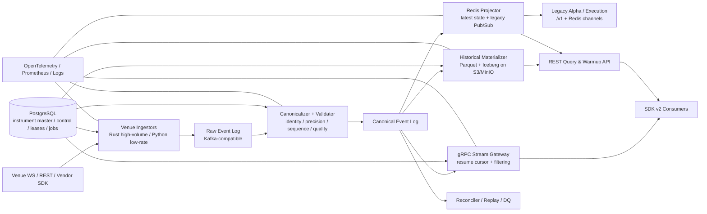
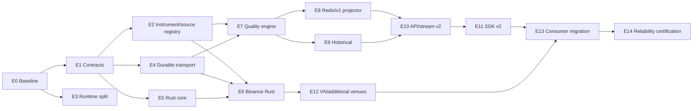

# Quant Data Layer — Fund-Grade Architecture & Migration Plan

> **Repository:** `BobbyAxerol/quant-data-layer`
> **Document status:** Proposed target architecture and implementation roadmap
> **Architecture style:** Python + Rust, contract-first, durable event log, backward-compatible migration
> **Primary audience:** Data platform, quant research, alpha, execution, risk, infrastructure, SRE
> **Scope:** Market-data acquisition, normalization, short historical warmup, live distribution, recovery, replay, quality control, SDK and compatibility
> **Out of scope:** Alpha decisions, portfolio logic, risk decisions, OMS/EMS, order routing, broker account state and execution ownership

---

## Document map

- **Implementation tracker:** [`DATA_LAYER_UNIFIED_IMPLEMENTATION_PLAN.md`](../DATA_LAYER_UNIFIED_IMPLEMENTATION_PLAN.md) translates this architecture into seven gated phases with status, test evidence, rollback and technical-debt decisions.
- **OKX provider specification:** [`OKX_MARKET_DATA_V5_GUIDE_QUANT_DATA_LAYER.md`](OKX_MARKET_DATA_V5_GUIDE_QUANT_DATA_LAYER.md) owns verified OKX V5 REST/WS/cursor/order-book/capability semantics and maps its P0-P4 workstream into these seven phases. It refines this architecture; it does not create provider-specific public contracts or a second durable backbone.

- **Sections 0–7:** scope, current state, principles, guarantees, target architecture, Python–Rust split and recommended stack.
- **Sections 8–19:** canonical domain/events, schema versioning, durable topics, venue adapters, quality/fallback, historical, warmup-to-live, API, SDK and alpha integration.
- **Sections 20–29:** service/monorepo decomposition, configuration, Redis compatibility, readiness, observability, security, testing, CI/CD and HA/DR.
- **Sections 30–35:** migration strategy, roadmap P0–P4, compatibility matrix, implementation epics, runbooks and governance.
- **Sections 36–43:** concrete configuration, performance/failure policy, prohibited anti-patterns, ADRs, acceptance checklist and final target state.
- **Appendices:** first production slice, adapter definition of done, non-functional requirements and the seven-phase execution index.

---

## 0. Executive summary

`quant-data-layer` cần được nâng cấp từ một **combined single-runtime market-data gateway** thành một **multi-venue market-data platform** có contract ổn định, có thể scale độc lập, có durable replay và không làm gián đoạn các alpha/trading services đang sử dụng `/v1`, Redis keys và Redis Pub/Sub hiện tại.

Kiến trúc đích không rewrite toàn bộ bằng Rust. Hệ thống chính thức dùng hai runtime:

- **Python** cho query API, control plane, historical warmup orchestration, instrument catalog, reconciliation, admin tooling, SDK và các provider có lưu lượng thấp hoặc chỉ có SDK Python tốt.
- **Rust** cho high-throughput live ingestion, WebSocket lifecycle, parsing, canonical normalization, sequence/gap tracking, order-book state, durable publication, projector và replay.

Các quyết định cốt lõi:

1. **Giữ `/v1` và các Redis contract cũ trong suốt giai đoạn migration.** Không thay shape hoặc semantics âm thầm.
2. **Tách API khỏi ingestion và history runtime.** Scale API không được tạo thêm venue connection hoặc duplicate publisher.
3. **Đặt durable append-only log trước Redis.** Redis trở thành latest-state cache và compatibility projection, không còn là source of truth.
4. **Dùng canonical schema độc lập venue.** Venue-native payload được bảo toàn ở raw layer nhưng không rò xuống stable public contract.
5. **Dùng Protobuf + Buf** làm contract chung cho Python, Rust, broker messages và gRPC streaming.
6. **Dùng Kafka-compatible durable log** làm backbone mục tiêu; production ưu tiên Apache Kafka hoặc một Kafka-compatible implementation đã được platform team phê duyệt. Redis Streams chỉ phù hợp làm bước chuyển tiếp, không phải target canonical backbone dài hạn.
7. **Dùng PostgreSQL** cho instrument master, provider metadata, subscription registry, control-plane revision, lease/fencing và job state; không dùng PostgreSQL để lưu tick stream chính.
8. **Dùng S3-compatible object storage + Parquet + Apache Iceberg** cho historical materialization, atomic snapshots, schema/partition evolution và replay-derived datasets.
9. **Bổ sung gRPC server-streaming cho `/v2` live contract**, REST cho warmup/query, và SDK để che broker/transport khỏi alpha.
10. **Cam kết “loss-detected, replayable, ordered-per-partition, effectively-once projection”**, không quảng bá exactly-once end-to-end vượt quá boundary có thể chứng minh.

Target flow:

```text
Venue WS/REST
    -> Rust/Python Venue Adapter
    -> Raw Event Log
    -> Canonicalizer + Quality Engine
    -> Canonical Event Log
       -> Redis latest-state + legacy Pub/Sub projector
       -> gRPC stream gateway
       -> Historical materializer -> Iceberg/Parquet
       -> Reconciler/replay
    -> REST Query/Warmup API + SDK
```

Migration phải theo mô hình **strangler + dual-run + shadow compare + dual-publish**, không cutover một lần.

---

## 1. Vai trò của `quant-data-layer` trong trading system

### 1.1 Service này sở hữu

`quant-data-layer` là market-data distribution và recovery layer của trading system. Nó sở hữu:

- Kết nối đến venue, exchange, broker-data API và market-data vendor.
- Authentication/session lifecycle cho market-data connection.
- Subscription planning và connection sharding.
- Provider rate-limit, retry, backoff, circuit breaker và failover policy.
- Raw payload capture trong retention được định nghĩa.
- Instrument identity resolution.
- Canonical normalization và precision semantics.
- Event ordering, duplicate detection, sequence-gap detection và resync.
- Durable live-event publication.
- Latest-state projections.
- Historical short warmup và materialized bars.
- Snapshot/cursor protocol để nối warmup với live stream.
- Data-quality status, lineage, provenance và reconciliation.
- Stable REST/gRPC/SDK contracts cho alpha, execution, risk và monitoring.
- Compatibility adapter cho các `/v1` endpoint, Redis key và Pub/Sub channel cũ.

### 1.2 Service này không sở hữu

- Tín hiệu alpha hoặc quyết định giao dịch.
- Portfolio construction.
- Position, balance, margin hoặc broker account state.
- Risk limit và risk decision.
- Order lifecycle, OMS/EMS hoặc smart order routing.
- Execution policy.
- PnL authoritative state.
- Alpha-specific feature engineering, trừ khi một derived dataset đã được chính thức hóa thành shared data product.

### 1.3 Nguyên tắc integration với trading system

- Alpha/execution/risk **không tự kết nối trực tiếp venue** khi data product tương ứng đã được data layer cung cấp.
- Consumer phụ thuộc vào **canonical instrument ID và schema version**, không phụ thuộc venue-native field name.
- Consumer không hardcode Redis channel mới; mọi subscription mới đi qua SDK hoặc generated contract.
- Data layer không tự quyết định một source fallback có đủ điều kiện cho execution. Nó cung cấp provenance/quality; policy cuối cùng do risk/execution requirement khai báo.
- Mọi alpha phải khai báo `DataRequirement` có thể audit được.

---

## 2. Current-state baseline và migration constraints

### 2.1 Baseline từ repo hiện tại

Implementation hiện tại đã có các thành phần hữu ích cần giữ và phát triển tiếp:

- FastAPI `/v1` cho health, latest-state, historical, preload, fallback và control-plane diagnostics.
- Binance spot và USD-M trade/kline WebSocket multiplexer.
- DNSE live stream và vnstock fallback.
- Binance/OKX historical wrappers.
- Redis latest keys và Redis Pub/Sub.
- VN historical warmup bằng local Parquet.
- `DataLayerClient` sync SDK cho Python services.
- Feed supervisor, reconnect/backoff, bounded queue, batching và metrics cơ bản.
- Provider folders, history modules, API route modules và market-universe registry đã bắt đầu tạo boundary.

Tuy nhiên FastAPI lifespan hiện vẫn khởi động Binance stream, DNSE, vnstock poller và preload watchdog trong cùng process. Control endpoint cũng tự mô tả runtime hiện tại là `combined_api_ingestion_history`. Vì vậy deployment API nhiều replica có thể kéo theo nhiều ingestion owner và duplicate publication.

Các contract hiện tại phải được xem là **legacy public surface**, không phải nền tảng để tiếp tục mở rộng trực tiếp.

### 2.2 Constraints bắt buộc

1. Các alpha hiện tại phải tiếp tục chạy trong khi migration.
2. `/v1` không được thay đổi breaking shape hoặc source semantics mà không có compatibility flag và release notice.
3. Các channel như `stream:trade:*`, `stream:kline:*`, `stream:vn:*` phải tiếp tục được publish trong migration window.
4. Redis key hiện tại phải tiếp tục hỗ trợ recovery cho service cũ.
5. Không yêu cầu mọi alpha cài Kafka client.
6. Không rewrite DNSE/vnstock sang Rust chỉ vì chuẩn hóa ngôn ngữ.
7. Không đưa quá nhiều thay đổi hạ tầng vào cùng một release.
8. Mọi cutover phải có shadow comparison, rollback path và consumer telemetry.
9. Contract mới không được encode assumption chỉ đúng với crypto; phải support equity, futures, perpetual, option, index và vendor/reference source.
10. Venue không được đồng nghĩa với toàn bộ trading system hay toàn bộ data layer.

### 2.3 Những lỗi cần khóa ngay trước khi mở rộng

- Không cho spot và futures ghi chung canonical kline namespace.
- Không dùng `market=auto` cho execution-grade flow mới.
- Không coalesce hoặc silent-drop trade/book-delta canonical event.
- Không dùng `float` làm canonical representation của price/quantity.
- Không biến missing/invalid numeric field thành `0` nếu `0` có thể là giá trị thị trường hợp lệ.
- Không cho GET warmup route tự ý thực hiện mutation dài và không có job identity.
- Không cho API replica tự sở hữu venue stream.
- Không cho arbitrary outbound fallback URL từ request.

---

## 3. Architecture principles

### 3.1 Contract-first, implementation-second

Public contract, event contract, quality semantics và versioning policy được định nghĩa trước adapter implementation. Python và Rust đều generate type từ cùng source schema.

### 3.2 Event log khác latest state

- **Event log** cần durability, replay, ordering và cursor.
- **Latest state** cần đọc nhanh và có thể rebuild.
- **Notification Pub/Sub** có thể mất message nếu consumer offline.

Không dùng một công nghệ hoặc một key/channel để giả định cả ba semantics.

### 3.3 Raw, canonical và derived là ba data products khác nhau

- **Raw:** bảo toàn payload từ source để audit/renormalize.
- **Canonical:** stable typed contract cho trading system.
- **Derived:** bars, snapshots, features hoặc materialized views được tạo từ canonical events.

Consumer không được đọc raw layer trừ diagnostics/research được cấp quyền rõ ràng.

### 3.4 No silent loss

Với lossless feed class như trade hoặc order-book delta:

- Nếu event không thể commit vào durable log, adapter phải retry/spool hoặc chuyển feed sang `DEGRADED/BLOCKED`.
- Không được tiếp tục báo healthy trong khi drop.
- Mọi loss phải có counter, quality event, incident context và gap record.

### 3.5 At-least-once transport, effectively-once projection

Duplicate có thể xuất hiện do retry/replay. Hệ thống dùng deterministic event ID, source sequence, idempotent producer và idempotent projector để đảm bảo state/output không bị áp dụng hai lần.

### 3.6 Ordering có boundary rõ ràng

Không cam kết global ordering. Cam kết ordering theo:

```text
partition_key = instrument_uid + feed_type + source_id
```

Với book delta, partition key và source sequence là bắt buộc.

### 3.7 Source fidelity trước convenience

Raw decimal, timestamps, source sequence và source identity được bảo toàn. Convenience conversions được thực hiện ở canonical layer với precision rõ ràng.

### 3.8 Fallback không được trộn âm thầm

Primary, secondary, reference và backfill là các source role khác nhau. Cross-venue reference data không tự động thay thế authoritative venue data trong execution-grade projection.

### 3.9 Scale theo workload, không scale toàn bộ service cùng nhau

- API scale theo request load.
- Ingestor scale theo venue/market/shard.
- Canonicalizer/projector scale theo event partitions.
- History materializer scale theo data partitions/jobs.
- Reconciler scale theo audit workload.

### 3.10 Backward compatibility là feature bắt buộc

Legacy projector và compatibility API là thành phần chính thức của migration, không phải temporary hack không có owner.

---

## 4. Data guarantees và service objectives

### 4.1 Phân loại feed semantics

| Feed class | Canonical behavior | Coalescing | Sequence requirement | Revision |
|---|---|---:|---:|---:|
| Trade | Lossless đối với event đã nhận; replayable | Không | Trade ID hoặc source sequence nếu có | Không, trừ correction event |
| Order-book delta | Lossless; strict ordering; resnapshot khi gap | Không | Bắt buộc | Snapshot/reset event |
| Quote/BBO | Latest-state ưu tiên; canonical log vẫn giữ event theo retention | Chỉ được coalesce sau durable commit | Tùy source | Có thể |
| Ticker/mark price | Snapshot series | Chỉ ở projection | Tùy source | Có thể |
| Bar/kline | Update event trong interval; final event khi close | Có thể coalesce ở latest projection | Bar identity + revision | Bắt buộc |
| Funding/OI/ratio | Time-stamped observation | Không cần strict sequence nếu source không có | Observation ID | Có thể |
| Instrument metadata | Compacted/versioned state | N/A | Revision | Bắt buộc |
| Quality/status | Durable audit event | Không | Monotonic per feed instance | Có |

### 4.2 Định nghĩa “exact data” có thể chứng minh

Hệ thống không cam kết rằng venue không bao giờ bỏ event hoặc sửa data. Hệ thống cam kết:

1. **Source fidelity:** payload gốc và source metadata được bảo toàn trong raw retention.
2. **Accepted-event durability:** event được adapter chấp nhận chỉ được ack nội bộ sau khi durable commit hoặc durable local spool.
3. **Loss detection:** sequence gap, parser rejection, queue saturation và publication failure đều tạo quality signal.
4. **Replayability:** committed canonical event có cursor và replay trong retention.
5. **Deterministic normalization:** cùng raw payload + cùng normalizer version tạo cùng canonical output.
6. **Effectively-once state:** Redis/latest/history projector áp dụng event idempotently.
7. **Reconciled completeness:** feed có cơ chế resnapshot/backfill/reconciliation phù hợp capability của venue.
8. **Provenance:** mọi output xác định được venue, source provider, adapter version, schema version và normalizer version.

### 4.3 RPO/RTO mục tiêu

Các giá trị dưới đây là initial production targets và phải được benchmark trước khi trở thành contractual SLO:

| Capability | Target |
|---|---|
| RPO canonical log đã commit | 0 |
| Silent loss | 0 được chấp nhận |
| Feed gap detection | trong một sequence window hoặc freshness threshold |
| Ingest receive → durable commit p99 | `< 20 ms` nội bộ, không tính venue/network latency |
| Durable canonical → Redis projection p99 | `< 20 ms` |
| Warmup 1,000 bars cache hit p95 | `< 200 ms` |
| API availability | `>= 99.95%` theo tháng |
| Stream gateway availability | `>= 99.95%` theo tháng |
| Recovery sau process restart | replay tự động, không manual rebuild |
| Venue reconnect | theo venue policy, exponential backoff + jitter |
| Redis loss | rebuild từ canonical log, không mất source of truth |
| Historical partition commit | atomic hoặc không visible |

Không dùng một SLO chung cho mọi venue. Internet crypto venue, VN broker-data API và direct feed có latency/reliability profile khác nhau.

---

## 5. Target architecture



### 5.1 Logical planes

#### Data acquisition plane

- Venue connections.
- Subscription sharding.
- Raw decode.
- Receive timestamp.
- Raw durable publication.
- Connection/feed state machine.

#### Canonical data plane

- Instrument resolution.
- Precision normalization.
- Event ID.
- Sequence and gap tracking.
- Quality flags.
- Canonical durable publication.

#### Projection plane

- Redis latest keys.
- Redis legacy Pub/Sub.
- Compacted latest-state topic.
- gRPC streaming.
- Consumer-specific views nếu được phê duyệt.

#### Historical plane

- Historical provider fetch.
- Live-to-history materialization.
- Bar finalization/revision.
- Iceberg snapshots.
- Warmup cache.
- Compaction và retention.

#### Query plane

- Stateless REST query/warmup API.
- Snapshot endpoints.
- Instrument lookup.
- Feed/readiness status.
- Stable error model.

#### Control plane

- Venue/provider/instrument catalog.
- Subscription desired state.
- Lease/fencing.
- Config revisions.
- Job orchestration.
- Admin actions và audit.

#### Reliability plane

- Reconciliation.
- Replay.
- Gap management.
- DLQ/quarantine.
- Runbooks.

---

## 6. Python + Rust runtime strategy

### 6.1 Python responsibilities

Python tiếp tục là first-class runtime cho:

- FastAPI REST query/warmup API.
- Control plane và admin API.
- Instrument catalog service.
- Historical REST adapters và batch orchestration.
- VN/DNSE/vnstock adapter nếu throughput thấp và vendor SDK phù hợp Python.
- Reconciliation report, diagnostic và operational tooling.
- Iceberg/PyArrow/Polars materialization orchestration.
- Official Python SDK cho alpha và downstream service.
- Test oracle/reference implementation cho normalizer.
- Data science/research interfaces.

### 6.2 Rust responsibilities

Rust là primary data-plane runtime cho:

- Binance, OKX, Bybit và high-volume venue WebSocket ingestion.
- Connection lifecycle, auth refresh, heartbeat, reconnect và resubscribe.
- Zero/low-copy buffer handling.
- JSON/binary decode hot path.
- Canonical event construction.
- Decimal/fixed-point conversion.
- Event ID, duplicate detection, sequence/gap tracking.
- Order-book reconstruction.
- Kafka producer/consumer.
- Redis projector.
- Replay engine.
- High-throughput gRPC stream gateway.
- Checksums, compression và batch kernels.

### 6.3 Process boundary là mặc định

Live event không đi qua Python↔Rust FFI từng message. Ingestor Rust và API Python chạy thành process/container riêng, giao tiếp qua Protobuf + durable log.

PyO3 chỉ dùng cho batch kernel rõ ràng như:

- Normalize một Arrow batch.
- Checksum historical partitions.
- Reconstruct book từ một replay batch.
- Compression/encoding.

### 6.4 Không thêm Go/Java/C++ ở phase hiện tại

- Go không tạo capability đủ khác biệt so với Python control plane + Rust data plane.
- Java thêm JVM runtime và ecosystem vận hành không cần thiết cho repo hiện tại.
- C++ chỉ xem xét khi có direct multicast feed, colocated path, vendor C++ SDK bắt buộc, kernel bypass hoặc FPGA integration.

### 6.5 Promotion rule từ Python adapter sang Rust

Chuyển adapter sang Rust khi profiling cho thấy một hoặc nhiều điều kiện:

- CPU parser/normalizer chiếm phần lớn core.
- Event-loop lag vi phạm SLO trong burst.
- Queue gần đầy liên tục.
- GC/object allocation ảnh hưởng p99/p999.
- Cần strict order-book state.
- Replay phải nhanh hơn realtime nhiều lần.
- Phải shard thành quá nhiều Python process.
- Memory footprint dictionary/object quá lớn.

Không chuyển chỉ vì “Rust nhanh hơn”.

---

## 7. Recommended technology stack

### 7.1 Decision matrix

| Layer | Target technology | Status | Rationale |
|---|---|---|---|
| Python runtime | Python 3.13 production baseline; 3.14 compatibility CI | Target | Modern async/type performance; không bật free-threaded production nếu chưa benchmark |
| Python API | FastAPI + Pydantic v2 + Uvicorn | Keep/upgrade | Giữ compatibility và OpenAPI; một worker mỗi pod, scale bằng pod |
| Python HTTP | `httpx.AsyncClient` | Replace sync hot paths | Connection pooling, deadlines, cancellation và async I/O |
| Python DB | SQLAlchemy 2 + asyncpg + Alembic | Add | Typed persistence, migrations và control-plane metadata |
| Python batch | PyArrow + Polars; pandas compatibility only | Upgrade | Arrow-native data exchange; giảm object overhead |
| Rust runtime | Stable Rust pinned bởi `rust-toolchain.toml` | Add | Reproducible builds, memory/concurrency safety |
| Rust async | Tokio | Add | Standard async runtime cho network/data plane |
| Rust WS/HTTP | tokio-tungstenite + reqwest | Add | Venue connectivity |
| Rust serialization | serde + bytes; `serde_json` baseline, SIMD parser chỉ sau benchmark | Add | Correctness trước micro-optimization |
| Rust RPC/schema | prost + tonic | Add | Protobuf/gRPC cross-language contract |
| Rust Kafka | rust-rdkafka | Add | Mature librdkafka-based producer/consumer |
| Rust DB | sqlx | Add | Compile-time checked SQL/migrations integration |
| Contracts | Protocol Buffers + Buf | Add | Generated Python/Rust types; lint và breaking checks |
| Durable log | Kafka-compatible broker | Add | Partitioned durable replay log, retention, consumer groups |
| Latest-state cache | Redis | Keep | Fast reads, TTL, compatibility |
| Legacy stream | Redis Pub/Sub projector | Keep temporarily | Không làm hỏng alpha cũ |
| Metadata/control | PostgreSQL HA | Add | Instrument master, config, leases, jobs, audit |
| Object storage | S3-compatible storage; MinIO local/dev | Add | Shared immutable storage |
| Table format | Apache Iceberg + Parquet | Add | Atomic snapshots, schema/partition evolution, time travel |
| Local analytical query | DuckDB/Polars | Add | Warmup/read path nhẹ, không cần Spark cluster |
| Metrics | Prometheus-compatible | Add/standardize | Operational metrics/SLO |
| Telemetry | OpenTelemetry SDK + Collector | Add | Vendor-neutral metrics/traces/log correlation |
| Dashboard/alert | Grafana + Alertmanager | Add | SLO và incident response |
| Logs | Structured JSON → Loki/OpenSearch | Upgrade | Searchable correlation fields |
| Trace backend | Tempo/Jaeger hoặc managed backend | Optional | Control/recovery path tracing |
| Deployment | Docker Compose local; Kubernetes + Helm production target | Evolve | Role separation, HA, rollout, autoscaling |
| Secrets | External secret manager/Vault/KMS integration | Add | Không đưa venue credentials vào image/repo |
| Supply chain | SBOM, image signing, dependency audit | Add | Production security gate |

### 7.2 Durable-log choice

Target architecture dùng **Kafka protocol** làm stable infrastructure boundary. Production có thể chạy Apache Kafka hoặc một Kafka-compatible broker đã qua platform review, nhưng application code không dùng proprietary API.

Việc triển khai theo ba stage để tránh thêm hạ tầng trước khi domain và load semantics được chứng minh:

1. **Stage A — transport contract:** định nghĩa event ID, partition key, `EventSink`, `EventSource`, cursor/checkpoint, retry và replay độc lập implementation; sửa queue/drop/coalescing theo feed class.
2. **Stage B — bounded durable bridge:** dùng dedicated Redis Streams có AOF/`noeviction`/bounded trim hoặc local WAL/spool cho một demanded feed slice. Không dùng `redis_marketdata` ephemeral hiện tại và không quảng bá bridge thành public contract.
3. **Stage C — Kafka-compatible promotion:** chỉ provision/cutover khi benchmark và consumer inventory chứng minh replay horizon, consumer groups, raw trade/book throughput hoặc HA đã vượt safe envelope của bridge.

Stage sequencing không thay target architecture. Nó làm cho correctness, replay contract và operational evidence tồn tại trước khi chọn broker. Single-node Kafka-compatible deployment chỉ chứng minh protocol/replay; HA production vẫn cần topology độc lập với failure domain hiện tại.

Production baseline:

```text
replication.factor = 3
min.insync.replicas = 2
producer acks = all
enable.idempotence = true
unclean.leader.election.enable = false
compression.type = lz4 hoặc zstd sau benchmark
```

Các setting trên không tạo exactly-once end-to-end. Chúng bảo vệ producer retry/durability trong Kafka boundary. Canonicalizer dùng transactions khi consume raw và produce canonical cần atomic offset+output.

Redis Streams có thể được dùng như **migration bridge** nếu chưa thể triển khai Kafka ngay, với giới hạn rõ ràng:

- Không trở thành public contract.
- Topic/transport abstraction phải giữ khả năng đổi sang Kafka.
- Không lưu full long-retention market history trong Redis.
- Chỉ dùng trong P0/P1 transition hoặc deployment nhỏ.
- Chạy trên persistence/memory policy riêng; không chia sẻ `allkeys-lru`, AOF-off market-data cache.
- Có promotion metrics: retained events/time, trim loss, consumer lag, replay recovery time, memory/disk amplification và operator recovery steps.

### 7.3 Redis target role

Redis production chỉ giữ:

- Latest snapshot.
- Short-TTL live state.
- Consumer compatibility channels.
- Rate-limit/cache data không authoritative.
- Optional distributed cache cho warmup.

Redis policy:

- Canonical state có thể rebuild từ log.
- Không dùng `allkeys-lru` cho critical latest keys; ưu tiên `noeviction` hoặc tách cache instance.
- Key có `environment`, `schema major`, `venue`, `market`, `feed`, `instrument`.
- Pub/Sub không được dùng cho cursor/replay guarantee.
- Redis outage không được làm venue ingestor drop canonical event.

### 7.4 Object storage và Iceberg

Local Parquet được giữ làm dev/read cache, nhưng authoritative historical data chuyển sang:

```text
S3/MinIO
  /warehouse
    /market_data_raw
    /market_data_canonical
    /bars
    /snapshots
    /quality
```

Iceberg cung cấp table snapshot và atomic metadata commit. Không overwrite một file Parquet mutable theo symbol. Materializer ghi immutable data files rồi commit snapshot.

Không đưa Spark vào ngay. Dùng PyIceberg/PyArrow/Polars cho workload hiện tại; Spark/Flink chỉ thêm khi volume/compute profile chứng minh cần.

### 7.5 PostgreSQL target role

PostgreSQL lưu:

- Venue/provider definitions.
- Instrument master và alias history.
- Session calendars.
- Data-source policy.
- Subscription desired state.
- Ingestion shard assignment.
- Lease và fencing epoch.
- Job state/idempotency key.
- Consumer registrations/version telemetry.
- Gap/reconciliation metadata.
- Audit log và control-plane change revision.

Không lưu từng trade/tick vào PostgreSQL.

---

## 8. Canonical domain model

### 8.1 Không đồng nhất venue, provider và source

- **Venue:** nơi instrument được giao dịch hoặc market được hình thành, ví dụ Binance, OKX, HOSE.
- **Provider:** endpoint/vendor cung cấp dữ liệu, ví dụ DNSE, vnstock hoặc direct venue API.
- **Source instance:** một concrete connection/feed instance có session ID, adapter version và lease epoch.
- **Source role:** `PRIMARY`, `SECONDARY`, `REFERENCE`, `BACKFILL`.

Ví dụ FPT có venue HOSE, provider DNSE và vnstock. BTC perpetual trên Binance có venue Binance, provider direct Binance API.

### 8.2 Canonical instrument identity

Dùng hai identity:

1. `instrument_uid`: immutable UUID/opaque ID dùng cho partitioning và DB relations.
2. `instrument_id`: stable human-readable canonical string dùng cho API/logging.

Format đề xuất:

```text
{VENUE}.{MARKET}.{PRODUCT}.{SYMBOL}

BINANCE.SPOT.SPOT.BTC-USDT
BINANCE.USDM.PERPETUAL.BTC-USDT
OKX.SWAP.PERPETUAL.BTC-USDT
HOSE.EQUITY.COMMON.FPT
HNX.DERIVATIVES.FUTURE.VN30F1M
```

Không dùng `BTCUSDT` đơn lẻ làm identity.

### 8.3 Instrument record

```yaml
instrument_uid: "uuid"
instrument_id: "BINANCE.USDM.PERPETUAL.BTC-USDT"
venue: "BINANCE"
market: "USDM"
asset_class: "CRYPTO"
product_type: "PERPETUAL"
native_symbol: "BTCUSDT"
base_asset: "BTC"
quote_asset: "USDT"
settlement_asset: "USDT"
price_tick: "0.10"
quantity_step: "0.001"
contract_multiplier: "1"
expiry_time: null
session_calendar_id: "CRYPTO_24X7"
status: "ACTIVE"
metadata_revision: 17
valid_from: "..."
valid_to: null
```

Mọi event chứa `instrument_uid` và `instrument_revision` để dữ liệu lịch sử vẫn giải thích được khi tick size/metadata thay đổi.

### 8.4 Instrument alias

Bảng alias map:

```text
provider + market + native_symbol + valid_time_range
    -> instrument_uid + metadata_revision
```

Alias resolution phải temporal. Không assume native symbol không bao giờ được reuse.

### 8.5 Session calendar

Calendar phải versioned và hỗ trợ:

- Timezone IANA.
- Trading date.
- Continuous sessions.
- Auction sessions.
- Lunch breaks.
- Holidays.
- Special sessions.
- Early close.
- Halt status.
- 24/7 markets.

Không hardcode chỉ weekday + giờ trong nhiều module. `session_calendar_id` là nguồn duy nhất cho freshness, bar finalization và preload schedule.

### 8.6 Data-source policy

```yaml
policy_id: execution_binance_usdm_v1
instrument_pattern: "BINANCE.USDM.*"
feed: trade
allowed_source_roles: [PRIMARY]
max_freshness_ms: 1000
allow_cross_venue_reference: false
on_gap: BLOCK
on_stale: BLOCK
on_fallback: BLOCK
```

Research policy có thể cho phép `REFERENCE`, nhưng event vẫn mang source identity.

---

## 9. Canonical event contracts

### 9.1 Common envelope

Mọi canonical event có common envelope:

```protobuf
syntax = "proto3";

package qdl.marketdata.v2;

message EventEnvelope {
  string schema_name = 1;             // qdl.marketdata.trade
  uint32 schema_major = 2;            // 2
  uint32 schema_minor = 3;            // additive evolution
  bytes event_id = 4;                  // deterministic 16/32-byte ID

  string instrument_uid = 5;
  string instrument_id = 6;
  uint64 instrument_revision = 7;

  string venue = 8;
  string market = 9;
  string product_type = 10;
  string native_symbol = 11;

  string provider = 12;
  string source_id = 13;
  SourceRole source_role = 14;
  uint64 lease_epoch = 15;

  int64 source_event_time_ns = 16;
  int64 received_at_ns = 17;
  int64 normalized_at_ns = 18;
  int64 published_at_ns = 19;

  string source_sequence = 20;
  uint64 partition_sequence = 21;
  string normalizer_version = 22;
  string adapter_version = 23;

  repeated QualityFlag quality_flags = 24;
  bytes raw_payload_hash = 25;
  string correlation_id = 26;

  oneof payload {
    Trade trade = 40;
    Quote quote = 41;
    Bar bar = 42;
    BookSnapshot book_snapshot = 43;
    BookDelta book_delta = 44;
    FundingRate funding_rate = 45;
    OpenInterest open_interest = 46;
    MarketStatus market_status = 47;
    QualityEvent quality_event = 48;
  }
}
```

Field number đã dùng không được reuse.

### 9.2 Decimal representation

Không dùng binary `float` trong canonical Protobuf.

Default representation:

```protobuf
message DecimalValue {
  sint64 mantissa = 1;
  sint32 scale = 2;
}
```

Ví dụ `61234.10`:

```text
mantissa = 6123410
scale = 2
```

Nếu một product vượt range `int64`, dùng decimal128 bytes hoặc canonical decimal string trong schema major mới; không silently overflow.

Raw payload vẫn giữ decimal string gốc.

### 9.3 Trade

```protobuf
message Trade {
  string native_trade_id = 1;
  DecimalValue price = 2;
  DecimalValue quantity = 3;
  AggressorSide aggressor_side = 4;
  bool is_block_trade = 5;
  bool is_buyer_maker = 6;
}
```

Rules:

- `native_trade_id` không được cast mất precision.
- Unknown side là enum `UNSPECIFIED`, không tự suy ra sai.
- Duplicate key ưu tiên venue+market+instrument+trade ID.
- Không coalesce trade canonical event.

### 9.4 Quote/BBO

```protobuf
message Quote {
  DecimalValue bid_price = 1;
  DecimalValue bid_quantity = 2;
  DecimalValue ask_price = 3;
  DecimalValue ask_quantity = 4;
  uint32 level = 5;
}
```

Missing side dùng field absence/optional semantics, không dùng zero.

### 9.5 Bar/kline

```protobuf
message Bar {
  string interval = 1;
  int64 open_time_ns = 2;
  int64 close_time_ns = 3;
  DecimalValue open = 4;
  DecimalValue high = 5;
  DecimalValue low = 6;
  DecimalValue close = 7;
  DecimalValue volume = 8;
  uint64 trade_count = 9;
  bool is_final = 10;
  uint32 revision = 11;
  BarOrigin origin = 12; // VENUE_NATIVE, AGGREGATED, BACKFILLED
}
```

Identity:

```text
instrument_uid + interval + open_time + source_id
```

Bar update có revision tăng. Consumer không được assume event đầu tiên là final.

### 9.6 Order book

Book snapshot và delta phải có:

- Native sequence start/end.
- Snapshot sequence.
- Checksum nếu venue cung cấp.
- Side/price/quantity update.
- Reset marker.
- Gap/resync state.

Projector không apply delta nếu sequence continuity không được chứng minh.

### 9.7 Timestamps

Bốn timestamp không thay thế nhau:

- `source_event_time_ns`: venue/provider timestamp.
- `received_at_ns`: thời điểm adapter nhận payload.
- `normalized_at_ns`: hoàn tất canonicalization.
- `published_at_ns`: producer commit request/event publication time.

Nếu source không cung cấp event time, flag `SOURCE_TIME_MISSING` và không copy `received_at` vào source time mà không đánh dấu.

### 9.8 Event ID

Ưu tiên deterministic ID:

```text
hash(schema_major,
     venue,
     market,
     instrument_uid,
     feed_type,
     source_id,
     native_trade_id/source_sequence/bar_identity,
     revision)
```

Nguồn không có stable sequence dùng hash payload + source timestamp + source-instance monotonic counter; quality flag phải phản ánh mức confidence.

### 9.9 Quality flags

Các flag tối thiểu:

```text
SOURCE_TIME_MISSING
SEQUENCE_MISSING
SEQUENCE_GAP_BEFORE
DUPLICATE
OUT_OF_ORDER
LATE
STALE
PARSER_PARTIAL
FIELD_MISSING
PRECISION_ADJUSTED
SOURCE_FALLBACK
SOURCE_REFERENCE_ONLY
BACKFILLED
REVISED
CHECKSUM_FAILED
RESYNC_REQUIRED
CLOCK_SKEW_SUSPECTED
```

Không loại event chỉ vì có quality flag trừ validation policy quy định. Invalid event đi quarantine topic cùng reason và raw reference.

### 9.10 Feed state machine

```text
DISABLED
  -> STARTING
  -> CONNECTING
  -> SUBSCRIBING
  -> SYNCING
  -> LIVE
  -> DEGRADED
  -> GAPPED
  -> RESYNCING
  -> LIVE
  -> STALE
  -> OFFLINE
  -> HALTED/MARKET_CLOSED
```

State change là durable `MarketStatus`/`QualityEvent`, không chỉ là log line.

---

## 10. Contract and schema versioning

### 10.1 Version dimensions

Version riêng cho:

- REST API major: `/v1`, `/v2`.
- Protobuf package major: `qdl.marketdata.v2`.
- Event schema minor: additive field evolution.
- SDK semantic version.
- Adapter version.
- Normalizer version.
- Instrument metadata revision.
- Historical table snapshot/schema ID.

Không dùng một `version="0.1.0"` để đại diện tất cả.

### 10.2 Compatibility policy

Trong cùng major:

- Chỉ add optional fields hoặc enum values theo rules đã kiểm tra.
- Không đổi field meaning.
- Không đổi unit/precision.
- Không rename/remove required contract field.
- Không reuse Protobuf field number.
- Consumer phải ignore unknown fields.

Breaking change yêu cầu:

1. New major package/path/topic/channel.
2. Dual-publish.
3. SDK hỗ trợ song song.
4. Consumer inventory và usage telemetry.
5. Shadow parity.
6. Deprecation notice.
7. Approved cutover.
8. Sunset chỉ khi không còn registered consumer.

### 10.3 Buf gate

CI bắt buộc:

```bash
buf format --diff --exit-code
buf lint
buf breaking --against '.git#branch=main'
buf generate
```

Generated code được build và test cho cả Python/Rust. Không sửa generated files thủ công.

### 10.4 REST compatibility

- `/v1` frozen theo observed behavior, không chỉ docs.
- `/v2` trả typed envelope nhất quán.
- Response header chứa `X-QDL-Schema`, `X-QDL-Request-Id`, `X-QDL-Data-As-Of` khi phù hợp.
- Deprecated `/v1` response thêm `Deprecation`/`Sunset` metadata khi bắt đầu sunset.
- Error dùng `application/problem+json`-style stable fields.

### 10.5 Topic compatibility

Topic major nằm trong name:

```text
md.raw.v1.*
md.canonical.v2.*
md.quality.v1.*
```

Minor additive evolution không đổi topic. Breaking event shape tạo topic major mới.

---

## 11. Durable topic, partition and retention design

### 11.1 Topic taxonomy

```text
md.raw.v1.{venue}.{market}.{feed}
md.canonical.v2.trade
md.canonical.v2.quote
md.canonical.v2.bar
md.canonical.v2.book_snapshot
md.canonical.v2.book_delta
md.canonical.v2.funding_rate
md.canonical.v2.open_interest
md.status.v1.feed
md.quality.v1.event
md.quarantine.v1.invalid
md.control.v1.instrument
md.control.v1.subscription
md.snapshot.v1.latest
```

Không tạo một topic cho mỗi symbol. Topic count phải bounded; instrument nằm trong key/header.

### 11.2 Partition key

Default:

```text
key = hash(instrument_uid, feed_type, source_id)
```

Mục tiêu:

- Event cùng instrument/feed/source vào cùng partition.
- Ordering được giữ trong partition.
- Consumer group có thể scale.
- Book snapshot/delta của một source không bị tách partition.

Với derived bar có thể partition theo `instrument_uid + interval`.

### 11.3 Retention baseline

| Topic/data | Initial retention | Notes |
|---|---:|---|
| Raw live event log | 24–72 giờ | Đủ audit/re-normalization ngắn; archive chọn lọc sang object storage |
| Canonical trade/quote | 7–30 ngày | Phụ thuộc volume và compliance |
| Book delta | 24–72 giờ | Volume cao; snapshots định kỳ |
| Bar/funding/OI | 30–180 ngày | Historical materializer lưu lâu hơn |
| Quality/status | 90–365 ngày | Incident/audit |
| Quarantine | >= 30 ngày | Phục vụ parser fixes |
| Instrument/config | Compacted + history | Versioned state |

Retention là config theo environment/data class, không hardcode trong adapter.

### 11.4 Raw and canonical transaction

Hai deployment mode:

#### Initial low-latency mode

Một Rust ingestor:

1. Nhận raw payload.
2. Resolve identity/validate tối thiểu.
3. Trong một producer transaction, ghi raw event và canonical event.
4. Commit.

Ưu điểm: ít hop, dễ bắt đầu. Nhược điểm: adapter và normalizer deploy cùng nhau.

#### Decoupled scale mode

1. Ingestor ghi raw topic.
2. Canonicalizer consumer group đọc raw.
3. Transactionally produce canonical + commit consumed offsets.

Ưu điểm: renormalize/replay độc lập; scale theo type. Nhược điểm: thêm latency/hạ tầng.

Repo nên code theo logical interface cho cả hai, deploy initial mode trước nếu volume chưa cần tách.

### 11.5 Idempotence and retry

Producer:

- Idempotence enabled.
- `acks=all`.
- Bounded retry có deadline nhưng không silent-drop.
- Local disk spool nếu broker outage vượt in-memory buffer.
- Spool file có checksum, segment ID và replay state.
- Feed chuyển `DEGRADED` khi spool > threshold.
- Feed chuyển `BLOCKED` khi spool disk gần đầy.

Consumer/projector:

- Store last applied `event_id`/sequence theo partition/instrument.
- Apply output trước, commit offset sau.
- Retry idempotently.
- Poison event vào quarantine sau bounded attempts; không block toàn partition vô hạn nếu policy cho phép.

### 11.6 DLQ/quarantine

Invalid event record phải có:

```text
raw_topic
raw_partition
raw_offset
source_id
adapter_version
normalizer_version
error_code
error_message
raw_payload_hash
quarantined_at
retry_count
```

Fix parser có thể replay quarantine bằng explicit job với new normalizer version.

---

## 12. Venue adapter architecture

### 12.1 Capability-based adapter, không route bằng `if provider == ...`

Adapter khai báo capability:

```protobuf
message VenueCapabilities {
  bool supports_trades = 1;
  bool supports_quotes = 2;
  bool supports_order_book = 3;
  repeated string native_bar_intervals = 4;
  bool has_trade_id = 5;
  bool has_sequence = 6;
  bool supports_snapshot = 7;
  bool supports_historical_backfill = 8;
  string timestamp_precision = 9;
  string rate_limit_model = 10;
}
```

### 12.2 Rust traits

```rust
#[async_trait]
pub trait VenueAdapter: Send + Sync {
    fn descriptor(&self) -> &VenueDescriptor;
    fn capabilities(&self) -> &VenueCapabilities;

    async fn discover_instruments(&self) -> Result<Vec<NativeInstrument>>;
    async fn plan_subscriptions(
        &self,
        desired: &[SubscriptionSpec],
    ) -> Result<Vec<ConnectionShard>>;

    async fn run_shard(
        &self,
        shard: ConnectionShard,
        sink: RawEventSink,
        cancellation: CancellationToken,
    ) -> Result<()>;

    async fn fetch_snapshot(&self, request: SnapshotRequest) -> Result<RawSnapshot>;
    async fn fetch_history(&self, request: HistoricalRequest) -> Result<RawHistoricalBatch>;
}
```

Adapter không biết Redis key hoặc public REST route.

### 12.3 Python protocols

```python
class HistoricalAdapter(Protocol):
    descriptor: VenueDescriptor
    capabilities: VenueCapabilities

    async def fetch_history(self, request: HistoricalRequest) -> RawHistoricalBatch: ...
    async def discover_instruments(self) -> list[NativeInstrument]: ...

class LowRateLiveAdapter(Protocol):
    async def events(self, subscriptions: list[SubscriptionSpec]) -> AsyncIterator[RawVenueEvent]: ...
```

Python adapter cũng publish vào cùng raw/canonical transport contract.

### 12.4 Adapter package isolation

Mỗi adapter có:

```text
adapter/
  descriptor
  auth
  rate_limit
  symbol_mapping
  websocket
  rest
  parser
  sequence_policy
  snapshot_policy
  fixtures
  conformance_tests
```

Không import route, Redis implementation hoặc alpha package.

### 12.5 Connection shard planning

Input:

- Desired subscriptions.
- Venue connection limits.
- Max streams/connection.
- Symbol priority.
- Feed criticality.
- Geographic endpoint.

Output deterministic `ConnectionShard`:

```yaml
shard_id: binance-usdm-trade-003
venue: BINANCE
market: USDM
feed: TRADE
symbols: [...]
endpoint: ...
lease_key: ...
config_revision: 42
```

Không cắt `urls[:max_conns]` âm thầm. Nếu cap làm thiếu subscription:

- Control plane trả `PARTIALLY_ASSIGNED`.
- Missing instruments có status rõ.
- Readiness không báo full healthy.

### 12.6 Lease and fencing

Mỗi shard có đúng một active owner.

PostgreSQL table:

```text
ingestion_lease(
  shard_id primary key,
  owner_instance_id,
  lease_epoch bigint,
  lease_expires_at,
  heartbeat_at,
  config_revision
)
```

Acquire/renew bằng atomic transaction. Mỗi lần owner đổi, `lease_epoch` tăng. Mọi raw/canonical event chứa epoch. Canonicalizer/projector từ chối event từ stale epoch sau khi newer epoch đã observed.

Lease mà không có fencing chưa đủ vì old owner có thể publish sau network partition.

### 12.7 Venue lifecycle

Adapter phải implement:

1. Resolve credentials/endpoints.
2. Acquire shard lease.
3. Connect.
4. Authenticate nếu cần.
5. Subscribe.
6. Confirm subscription.
7. Snapshot/sync nếu feed yêu cầu.
8. Mark `LIVE` chỉ sau continuity proof.
9. Emit heartbeats/metrics.
10. Reconnect với exponential backoff + jitter.
11. Resubscribe deterministic.
12. Resnapshot nếu sequence continuity không đảm bảo.
13. Release/expire lease khi shutdown.

### 12.8 Rate limiting

Rate-limit service/library theo venue scope:

- Endpoint group.
- API key/account.
- IP.
- Request weight.
- Burst và sustained quota.

Historical batch không được spawn concurrency vượt venue quota chỉ vì caller truyền `concurrency=30`.

### 12.9 Backpressure

Feed class policy:

- Trade/book delta: không drop; durable spool hoặc block upstream read trong giới hạn venue connection.
- Quote/ticker: canonical commit trước; downstream latest projection có thể coalesce.
- Status/quality: không drop.

Queue metrics gồm current size, high-water mark, enqueue latency, dequeue latency và rejected count.

### 12.10 Adapter certification gate

Một adapter production phải pass:

- Instrument discovery fixtures.
- Auth/session renewal.
- Subscription ack verification.
- Reconnect/resubscribe.
- Duplicate and out-of-order fixtures.
- Sequence-gap and resnapshot.
- Rate-limit responses.
- Malformed payload/quarantine.
- Clock skew.
- Venue maintenance response.
- 24h soak hoặc market-session soak phù hợp.
- Shadow parity với reference implementation/source.
- Load test ở expected peak × safety factor.
- Security review/outbound allowlist.

---

## 13. Canonicalization and data-quality engine

### 13.1 Pipeline

```text
Raw payload
  -> envelope validation
  -> source identity verification
  -> instrument alias resolution
  -> native type validation
  -> decimal/time normalization
  -> event identity
  -> sequence/order validation
  -> quality flags
  -> canonical schema validation
  -> durable publication
```

### 13.2 Validation levels

- **Transport valid:** payload decode được.
- **Source valid:** fields bắt buộc của venue có mặt/type đúng.
- **Canonical valid:** map được instrument và canonical schema.
- **Execution eligible:** quality/source/freshness policy đáp ứng execution requirement.

Canonical valid không đồng nghĩa execution eligible.

### 13.3 Missing-field policy

- Missing numeric field -> absent/optional + `FIELD_MISSING`.
- Invalid decimal -> quarantine hoặc partial event theo feed policy.
- Không convert missing thành zero.
- Không cast string ID sang float/int có nguy cơ overflow.

### 13.4 Sequence and gap ledger

State per source+instrument+feed:

```text
last_sequence
last_event_id
last_source_time
last_received_time
gap_state
expected_next_sequence
resync_attempt
lease_epoch
```

Khi gap:

1. Emit `SEQUENCE_GAP_DETECTED`.
2. Mark feed `GAPPED`.
3. Stop execution-eligible projection cho book delta.
4. Fetch snapshot/replay/backfill theo adapter capability.
5. Verify continuity.
6. Emit `RESYNC_COMPLETED` hoặc `RESYNC_FAILED`.
7. Return `LIVE` chỉ khi verified.

### 13.5 Duplicate handling

Duplicate canonical event vẫn có thể được observed ở transport. Canonicalizer/projector dedup bằng:

- Source sequence/trade ID.
- Deterministic event ID.
- Bounded dedup cache.
- Persistent last-applied state cho projector.

Duplicate count là metric; duplicate không phải lỗi nếu retry semantics dự kiến, nhưng sudden increase là alert.

### 13.6 Clock discipline

- Host chạy NTP/chrony.
- Export clock-offset metrics.
- Flag source event time đi lùi bất thường.
- Không sửa source timestamp để làm đẹp dữ liệu.
- Derived latency dùng từng timestamp rõ ràng.

### 13.7 Normalizer versioning

Normalizer version là immutable build identifier. Khi logic normalization thay đổi:

- Bump normalizer version.
- Replay raw fixtures.
- Differential comparison.
- Nếu output semantics breaking, bump schema major hoặc derived dataset revision.
- Historical materializer ghi normalizer version vào table metadata.

---

## 14. Source selection, fallback and authority

### 14.1 Source roles

| Role | Meaning | Execution default |
|---|---|---|
| PRIMARY | Authoritative source đã được policy chọn | Có thể |
| SECONDARY | Cùng market, dùng khi primary unavailable theo approved policy | Chỉ khi policy cho phép |
| REFERENCE | Cross-venue/vendor comparison | Không |
| BACKFILL | Historical repair | Không cho live decision trực tiếp |

### 14.2 Không overwrite primary state bằng fallback âm thầm

Latest state lưu riêng:

```text
latest:{schema}:{source_id}:{instrument_uid}:{feed}
```

Policy projection có thể tạo:

```text
selected_latest:{policy_id}:{instrument_uid}:{feed}
```

Selected projection kèm:

```text
selected_source_id
source_role
selection_reason
policy_id
selected_at
freshness
quality
```

### 14.3 Cross-venue reference

OKX không được giả làm Binance USDM authoritative market. Nếu Binance feed stale:

- Binance feed status = `STALE/GAPPED`.
- OKX event vẫn publish dưới OKX instrument/source identity.
- Reference comparison service có thể tạo spread/diagnostic event.
- Execution chỉ dùng reference nếu risk policy explicit.

### 14.4 DNSE/vnstock

Với VN market data:

- Venue identity là exchange/instrument market.
- DNSE và vnstock là providers.
- Không splice row/event từ hai provider mà bỏ provenance.
- Fallback projection phải emit source switch event.
- After-hours last snapshot không được đánh dấu live.
- Trading calendar quyết định market closed, không dùng absence đơn thuần.

DNSE production acquisition boundary:

- REST market-history transport sends an explicit version header, verifies TLS
  and hostname, applies an explicit proxy policy, bounded quota/retry/backoff and
  strict OHLC/pagination validation. REST is cold-bootstrap/gap-repair only.
- Live final 1m bars use authenticated native `ohlc_closed.1`; they do not poll
  REST every minute. TRADE and BAR share the bounded lossless raw edge and reach
  consumers only through durable broker ACK plus the Rust canonical core.
- The last final BAR watermark is atomic and bound to slice, authority, catalog,
  acquisition revision and exact BAR bindings. It advances only after all
  related durable ACKs; corrupt, partial or mismatched state fails closed.
- An official SDK snapshot without a redistribution license is protocol
  reference, not vendored source. Insecure certificate disabling and examples
  carrying credentials are never copied into release artifacts.
- If the primary host cannot reach official DNSE REST, run a separately governed
  low-rate DNSE acquisition edge in an approved egress domain and publish
  authenticated raw envelopes over mTLS/ACL. Never relabel vnstock/V1 Parquet as
  `DNSE_DIRECT`; WebSocket-only collection may build durable future history but
  is not an instant replacement for a fresh 500-row bootstrap.

### 14.5 Failover state machine

```text
PRIMARY_HEALTHY
 -> PRIMARY_DEGRADED
 -> FAILOVER_PENDING
 -> SECONDARY_VALIDATING
 -> SECONDARY_ACTIVE
 -> PRIMARY_RECOVERING
 -> PRIMARY_SHADOW
 -> PRIMARY_ACTIVE
```

Mọi switch có cooldown/hysteresis để tránh flapping và có audit record.

---

## 15. Historical storage and short warmup architecture

### 15.1 Historical tiers

```text
Tier 0: Redis latest snapshot / hot warmup cache
Tier 1: Recent canonical log replay
Tier 2: Iceberg/Parquet materialized tables
Tier 3: Provider historical backfill / repair
```

Warmup API chọn tier theo request nhưng response contract không đổi.

### 15.2 Iceberg table design

Recommended logical tables:

```text
market_data.trade_v2
market_data.quote_v2
market_data.bar_v2
market_data.book_snapshot_v1
market_data.funding_rate_v1
market_data.open_interest_v1
market_data.quality_event_v1
market_data.instrument_revision_v1
```

Bar table partition example:

```text
days(open_time), bucket(64, instrument_uid), interval
```

Trade table có thể partition theo hour/day và bucket instrument, tùy volume. Không partition trực tiếp thành hàng triệu folder theo symbol.

### 15.3 Immutable files and atomic commit

Materializer:

1. Read canonical offsets `[start, end]`.
2. Build Arrow batch.
3. Validate schema, dedup và statistics.
4. Write immutable Parquet data file vào staging prefix.
5. Calculate checksum.
6. Commit Iceberg snapshot atomically.
7. Persist materialization checkpoint.
8. Chỉ sau commit mới advance consumer offset/job state.

Crash trước commit tạo orphan staging file có thể cleanup; không tạo partial visible table state.

### 15.4 Bar origin and revision

Một bar có thể từ:

- Venue-native kline.
- Aggregated trades.
- Historical provider backfill.
- Correction/reconciliation.

Không merge các origin mà mất lineage. Canonical key có source/origin; selected bar view áp dụng policy.

Finalization:

```text
OPEN -> UPDATING -> FINAL_CANDIDATE -> FINAL -> REVISED
```

`is_final=true` không ngăn correction event. Correction tăng `revision`.

### 15.5 Warmup read path

`GET /v2/market-data/{instrument_id}/warmup`:

1. Resolve instrument/revision.
2. Validate interval, limit, as-of và data policy.
3. Try Redis/hot cache.
4. Read Iceberg snapshot/Parquet using predicate pushdown.
5. Optional tail merge từ canonical log nếu materializer lag.
6. Dedup/revision-select.
7. Sort ascending.
8. Return snapshot metadata + stream cursor.

Không top-up provider synchronously trong normal GET path. Nếu data missing/stale:

- Return current data với quality metadata nếu policy cho phép.
- Hoặc `DATA_NOT_READY`.
- Submit explicit idempotent backfill job.

### 15.6 Historical jobs

```text
POST /v2/jobs/backfill
POST /v2/jobs/materialize
GET  /v2/jobs/{job_id}
```

Request có `Idempotency-Key`. Job state persist trong PostgreSQL:

```text
PENDING -> LEASED -> RUNNING -> VERIFYING -> COMMITTED -> SUCCEEDED
                                      -> FAILED_RETRYABLE
                                      -> FAILED_TERMINAL
                                      -> CANCELLED
```

Không dùng daemon thread không có persisted job identity.

### 15.7 Reconciliation

Scheduled reconciliation so sánh:

- Canonical event counts/sequence range.
- Iceberg row counts/checksum.
- Venue historical API sample/window.
- OHLCV invariants.
- Duplicate/revision counts.
- Missing intervals theo session calendar.

Gap/correction tạo explicit repair plan, không overwrite mutable file trực tiếp.

### 15.8 Local development

Docker Compose local có thể dùng:

- Single-node Kafka-compatible broker.
- MinIO.
- PostgreSQL.
- Redis.
- API/ingestor/projector containers.

Production durability settings không được copy giả lập từ local single-node.

---

## 16. Gap-free warmup-to-live handoff

### 16.1 New `/v2` protocol

Warmup response gồm:

```json
{
  "schema": "qdl.marketdata.warmup.v2",
  "instrument_id": "BINANCE.USDM.PERPETUAL.BTC-USDT",
  "feed": "bar",
  "interval": "1m",
  "snapshot_id": "...",
  "data_as_of_ns": 1786352400000000000,
  "stream_cursor": "opaque-signed-token",
  "last_partition_sequence": 918273,
  "quality": {
    "state": "LIVE",
    "complete": true,
    "source_role": "PRIMARY"
  },
  "data": []
}
```

Cursor chứa hoặc reference:

- Topic/partition/offset hoặc logical sequence.
- Instrument/feed filter.
- Schema major.
- Issued time/expiry.
- Snapshot ID.
- Integrity signature.

Consumer không parse cursor internals.

### 16.2 SDK algorithm

```text
1. Open stream subscription in buffered mode.
2. Receive/establish server cursor C_start.
3. Request warmup snapshot aligned to C_start.
4. Build local state from snapshot.
5. Drop buffered events <= snapshot watermark.
6. Verify first applied sequence/cursor.
7. Apply buffered/live events.
8. Persist last confirmed cursor.
```

Hoặc server hỗ trợ snapshot+stream RPC atomic logical flow. SDK che implementation.

### 16.3 Reconnect

- SDK reconnect bằng last confirmed cursor.
- Nếu cursor còn trong retention, replay từ cursor+1.
- Nếu expired, server trả `CURSOR_EXPIRED` với recovery instruction.
- SDK lấy snapshot mới và nối lại.
- Consumer không tự đoán gap chỉ bằng timestamp.

### 16.4 Legacy Redis consumer bridge

Với alpha chưa migrate:

1. Subscribe Redis trước và buffer.
2. Fetch latest/warmup.
3. Apply buffered messages mới hơn recovered state.
4. Nếu không chứng minh continuity, gọi top-up nhỏ và block execution theo policy.

Đây là best-effort compatibility; không được mô tả tương đương cursor-backed `/v2`.

---

## 17. Stable API design

### 17.1 API surfaces

#### Query API — REST/JSON

```text
GET /v2/instruments
GET /v2/instruments/{instrument_id}
GET /v2/market-data/{instrument_id}/snapshot
GET /v2/market-data/{instrument_id}/warmup
POST /v2/market-data/warmup:batch
GET /v2/feeds/{instrument_id}/status
GET /v2/data-quality/gaps
GET /v2/system/readiness
```

#### Streaming API — gRPC/Protobuf

```protobuf
service MarketDataStreamService {
  rpc Subscribe(SubscribeRequest) returns (stream EventEnvelope);
  rpc Replay(ReplayRequest) returns (stream EventEnvelope);
  rpc GetSnapshot(SnapshotRequest) returns (SnapshotResponse);
  rpc GetFeedStatus(FeedStatusRequest) returns (FeedStatusResponse);
}
```

#### Control/Admin API — separate listener/service

```text
POST /internal/v1/subscriptions
POST /internal/v1/jobs/backfill
POST /internal/v1/jobs/replay
POST /internal/v1/feeds/{shard}/pause
POST /internal/v1/feeds/{shard}/resume
GET  /internal/v1/leases
GET  /internal/v1/audit
```

Không expose control endpoint trên public alpha-facing listener.

### 17.2 Provider-neutral public routes

Public `/v2` lấy `instrument_id`, không lấy `provider` trong path. Source selection được điều khiển bởi `data_policy` hoặc explicit diagnostic query.

```text
/v1/crypto/ohlcv/binance/BTCUSDT
    -> legacy compatibility

/v2/market-data/BINANCE.SPOT.SPOT.BTC-USDT/warmup?feed=bar&interval=1m
    -> canonical stable contract
```

### 17.3 Snapshot endpoint

```json
{
  "schema": "qdl.marketdata.snapshot.v2",
  "request_id": "...",
  "instrument": {
    "instrument_uid": "...",
    "instrument_id": "BINANCE.USDM.PERPETUAL.BTC-USDT",
    "revision": 17
  },
  "feed": "trade",
  "snapshot": {},
  "cursor": "...",
  "source": {
    "venue": "BINANCE",
    "provider": "BINANCE_DIRECT",
    "source_role": "PRIMARY",
    "source_id": "..."
  },
  "quality": {
    "state": "LIVE",
    "freshness_ms": 21,
    "gap": false,
    "execution_eligible": true,
    "policy_id": "execution_binance_usdm_v1"
  }
}
```

### 17.4 Batch response

Batch endpoint luôn có per-item status:

```json
{
  "schema": "qdl.marketdata.batch.v2",
  "request_id": "...",
  "partial": true,
  "results": [
    {"instrument_id": "...", "status": "OK", "data": {}},
    {"instrument_id": "...", "status": "DATA_NOT_READY", "problem": {}}
  ]
}
```

Không fail toàn batch chỉ vì một symbol, trừ request contract invalid.

### 17.5 Error model

Stable fields:

```json
{
  "type": "urn:qdl:error:data-not-ready",
  "title": "Market data is not ready",
  "status": 503,
  "code": "DATA_NOT_READY",
  "detail": "Feed is resynchronizing after sequence gap",
  "request_id": "...",
  "retryable": true,
  "retry_after_ms": 500,
  "instrument_id": "...",
  "quality_state": "RESYNCING"
}
```

Error taxonomy:

```text
INVALID_ARGUMENT
INSTRUMENT_NOT_FOUND
UNSUPPORTED_FEED
SCHEMA_NOT_SUPPORTED
DATA_NOT_READY
DATA_STALE
SOURCE_UNAVAILABLE
SOURCE_NOT_ALLOWED
SOURCE_NON_AUTHORITATIVE
OPEN_SEQUENCE_GAP
CURSOR_EXPIRED
CURSOR_INVALID
RATE_LIMITED
DEPENDENCY_UNAVAILABLE
PARTIAL_RESULT
CONFLICT
INTERNAL_ERROR
```

### 17.6 Time and units

- REST timestamps ISO-8601 UTC hoặc integer nanoseconds theo field contract; không mix âm thầm.
- Protobuf dùng nanoseconds integer.
- Interval dùng canonical enum/string registry.
- Response luôn nêu source timezone khi trả trading date/session context.

### 17.7 Caching

- ETag/snapshot ID cho instrument metadata và historical snapshots.
- Không cache live readiness quá freshness window.
- API cache key chứa schema major, instrument revision, feed, interval, as-of và policy.

---

## 18. SDK v2 architecture

### 18.1 SDK là compatibility and correctness boundary

Alpha không tự ghép REST + Redis/gRPC bằng ad-hoc code. SDK chịu trách nhiệm:

- Instrument resolution.
- API/schema negotiation.
- Warmup + stream handoff.
- Cursor persistence/reconnect.
- Dedup và sequence verification.
- Freshness/source/quality validation.
- Retry/deadline/circuit policy.
- Metrics và consumer identity.
- Legacy `/v1` fallback trong migration.

### 18.2 Packages

```text
qdl-sdk-python
qdl-sdk-rust
qdl-contracts-python (generated)
qdl-contracts-rust   (generated crate)
```

Python SDK có sync facade và async core. Sync facade không block event loop; docs phải cảnh báo context.

### 18.3 DataRequirement manifest

Mỗi alpha/service khai báo:

```yaml
consumer_id: alpha_basis_v3
sdk_major: 2
requirements:
  - instrument_id: BINANCE.USDM.PERPETUAL.BTC-USDT
    feeds: [trade, bar]
    intervals: [1m]
    warmup_bars: 1000
    max_freshness_ms: 1000
    source_policy: execution_binance_usdm_v1
    on_stale: BLOCK
    on_gap: BLOCK
    recovery: SNAPSHOT_AND_REPLAY
```

Data layer có thể preflight toàn bộ manifest và trả readiness.

### 18.4 Python SDK usage

```python
from qdl_sdk import AsyncDataLayerClient, DataRequirement

client = AsyncDataLayerClient(
    query_url="http://qdl-api:8100",
    stream_target="qdl-stream:8443",
    consumer_id="alpha_basis_v3",
    schema_major=2,
)

requirement = DataRequirement(
    instrument_id="BINANCE.USDM.PERPETUAL.BTC-USDT",
    feed="bar",
    interval="1m",
    warmup_limit=1000,
    policy_id="execution_binance_usdm_v1",
)

async with client.warmup_then_stream(requirement) as session:
    state = build_indicators(session.warmup.data)
    async for event in session.events:
        state.apply(event)
```

### 18.5 Consumer cursor persistence

Options:

- Local durable file cho single-instance research consumer.
- Redis/PostgreSQL consumer checkpoint service cho production.
- Consumer-managed store qua SDK interface.

Cursor update phải atomic với consumer state nếu consumer cần exactly-once local processing; đó là consumer boundary, không phải data-layer global guarantee.

### 18.6 Compatibility facade

`DataLayerClient` hiện tại được giữ. SDK v2 có adapter methods:

```text
latest_trade(provider, symbol) -> resolve legacy instrument -> v2 snapshot hoặc /v1
warmup_ohlcv(...)              -> v2 warmup hoặc /v1
stream_trades(...)             -> legacy Redis trong compatibility mode
```

Không đổi behavior mặc định của existing class trong minor release. New class/name hoặc major SDK mới dùng semantics v2.

### 18.7 Consumer telemetry

SDK gửi/ghi nhận:

- `consumer_id`.
- SDK version.
- API/schema major.
- Endpoints/channels đang dùng.
- Last successful cursor.
- Consumer lag.
- Deprecated contract usage.

Telemetry không được chứa strategy secret hoặc alpha parameters.

---

## 19. Alpha and trading-service integration policy

### 19.1 Consumer grades

#### Execution-grade

- Primary/approved secondary source only.
- Strict freshness.
- Gap blocks decision.
- Cursor-backed stream.
- Instrument revision validated.
- No `market=auto`.
- No reference-only fallback.

#### Alpha-grade

- Warmup complete requirement.
- Live continuity/freshness policy tùy strategy.
- Có thể accept revised bars theo declared behavior.
- Research fallback phải explicit.

#### Research/monitoring-grade

- Có thể dùng reference/last snapshot.
- Quality flags vẫn bắt buộc hiển thị.
- Không được tái sử dụng output cho live execution nếu không qua policy gate.

### 19.2 Startup gate

Production consumer sequence:

1. Load `DataRequirement`.
2. Resolve instruments and revisions.
3. Check data-layer API/stream readiness.
4. Open buffered stream/cursor.
5. Load warmup snapshot.
6. Verify source policy and quality.
7. Build local state.
8. Apply buffered events.
9. Confirm continuity.
10. Enable alpha/execution.

### 19.3 Runtime behavior

On `STALE`, `GAPPED`, `RESYNCING` hoặc source switch:

- SDK emits typed control event.
- Consumer policy quyết định `BLOCK`, `PAUSE`, `DEGRADE`, `OBSERVE`.
- Không chỉ log warning rồi tiếp tục.

### 19.4 Bar revision behavior

Mỗi alpha khai báo:

- Chỉ process `is_final=true`.
- Hoặc process updates và support revision.
- Cách rollback/recompute indicator khi revised final bar.

SDK không silently replace historical candle trong local state mà không phát revision event.

### 19.5 Direct venue connections

Chỉ được phép khi:

- Data layer chưa support feed.
- Có approved exception với owner và expiry.
- Consumer vẫn publish requirement/observability.
- Migration plan về data layer đã được ghi nhận.

---

## 20. Runtime and service decomposition

### 20.1 Target deployable roles

| Runtime | Language | Responsibility | Scaling unit |
|---|---|---|---|
| `qdl-api` | Python | REST query, snapshot, warmup, instruments | HTTP load |
| `qdl-control` | Python | Config, subscriptions, jobs, leases, audit | Low-rate HA |
| `qdl-stream-gateway` | Rust | gRPC stream/replay/filtering | Connections + egress bandwidth |
| `qdl-ingestor-{venue}` | Rust/Python | Venue connection + raw/canonical publication | Venue/market/shard |
| `qdl-canonicalizer` | Rust | Raw→canonical, quality, sequence | Kafka partitions |
| `qdl-projector-redis` | Rust | Latest state + legacy Pub/Sub | Canonical partitions |
| `qdl-history-materializer` | Python/Rust | Iceberg/Parquet writes | Table/data partitions |
| `qdl-reconciler` | Python | Gap/backfill/checksum/quality jobs | Job partitions |
| `qdl-scheduler` | Python | Session-aware periodic jobs | Singleton with lease |
| `qdl-diagnostics` | Python | Active probes and operational tooling | On demand/scheduled |

### 20.2 Initial deployment simplification

Không cần deploy tất cả ngay. Initial P1 có thể:

```text
qdl-api
qdl-control-history-worker
qdl-ingestor-binance
qdl-ingestor-vn
qdl-projector-redis
Kafka + Redis + PostgreSQL + MinIO
```

Canonicalizer có thể nằm trong Rust ingestor ban đầu. Stream gateway thêm khi SDK v2 bắt đầu canary.

### 20.3 Dependency rules

```text
contracts/domain
    <- adapters
    <- ingestion/canonicalization
    <- transport/projectors
    <- API/SDK
```

Forbidden dependencies:

- Domain/contracts không import adapter.
- Adapter không import Redis key naming.
- API không import venue WebSocket loop.
- SDK không import application internals.
- Alpha example không nằm trong production package dependency graph.

### 20.4 Stateless vs stateful

Stateless:

- REST API.
- gRPC gateway, ngoài transient buffers.
- Most control API instances.

Stateful/log-backed:

- Ingestor connection state + durable spool.
- Canonicalizer sequence state.
- Projector checkpoint.
- Historical materializer checkpoints.

State phải recover từ Kafka/PostgreSQL/object storage, không chỉ process memory.

### 20.5 Scaling and ownership

- API: horizontal pod autoscaling bằng request/concurrency/latency.
- Gateway: scale theo active stream connection và egress.
- Ingestor: scale bằng desired shards, không HPA tùy ý.
- Canonicalizer/projector: consumer-group partition assignment.
- History: worker queue/job partition.
- Scheduler: one active lease owner, standby replicas.

### 20.6 Shutdown semantics

Graceful shutdown:

1. Mark instance draining.
2. Stop accepting new subscriptions/jobs.
3. Stop venue subscription or transfer lease.
4. Flush producer batches/spool metadata.
5. Commit safe checkpoints.
6. Close broker/DB connections.
7. Exit trước termination grace deadline.

Không cancel tasks rồi bỏ batch chưa commit.

---

## 21. Monorepo target structure

```text
quant-data-layer/
├── README.md
├── ARCHITECTURE.md
├── CHANGELOG.md
├── Cargo.toml
├── rust-toolchain.toml
├── pyproject.toml
├── uv.lock / poetry.lock             # chuyển package manager ở phase riêng
├── Makefile / justfile
│
├── contracts/
│   ├── buf.yaml
│   ├── buf.gen.yaml
│   ├── proto/
│   │   └── qdl/
│   │       ├── common/v1/
│   │       ├── instrument/v1/
│   │       ├── marketdata/v2/
│   │       ├── quality/v1/
│   │       ├── control/v1/
│   │       └── stream/v2/
│   ├── openapi/
│   │   ├── v1-frozen.yaml
│   │   └── v2.yaml
│   └── golden/
│       ├── binance/
│       ├── okx/
│       ├── dnse/
│       └── canonical/
│
├── python/
│   ├── qdl_api/
│   ├── qdl_control/
│   ├── qdl_history/
│   ├── qdl_reconciliation/
│   ├── qdl_sdk/
│   ├── qdl_adapters/
│   │   ├── dnse/
│   │   └── vnstock/
│   ├── qdl_common/
│   └── tests/
│
├── rust/
│   └── crates/
│       ├── qdl-domain/
│       ├── qdl-contracts/
│       ├── qdl-transport/
│       ├── qdl-venue-core/
│       ├── qdl-adapter-binance/
│       ├── qdl-adapter-okx/
│       ├── qdl-adapter-bybit/
│       ├── qdl-canonicalizer/
│       ├── qdl-sequence/
│       ├── qdl-orderbook/
│       ├── qdl-projector-redis/
│       ├── qdl-stream-gateway/
│       ├── qdl-replay/
│       └── qdl-cli/
│
├── migrations/
│   └── postgres/
│
├── deploy/
│   ├── compose/
│   ├── docker/
│   ├── helm/
│   └── environments/
│       ├── dev/
│       ├── staging/
│       └── prod/
│
├── tests/
│   ├── contract/
│   ├── compatibility/
│   ├── differential/
│   ├── replay/
│   ├── integration/
│   ├── chaos/
│   ├── performance/
│   └── recordings/
│
├── docs/
│   ├── adr/
│   ├── runbooks/
│   ├── api/
│   ├── data-contracts/
│   └── migration/
│
└── legacy/
    └── app_v1/                       # chỉ sau khi import paths được bridge
```

### 21.1 Mapping từ repo hiện tại

| Current | Target |
|---|---|
| `app/main.py` | `python/qdl_api/app.py`; ingestion lifecycle bị loại khỏi API |
| `app/api/*` | `python/qdl_api/routes/v1` và `routes/v2` |
| `app/providers/binance` | historical Python adapter; live chuyển dần sang Rust crate |
| `app/providers/okx` | Python historical + Rust live adapter |
| `app/stream/*` | compatibility/reference; logic mới vào Rust venue core |
| `app/cache/redis_cache.py` | Python cache reader + Rust projector contract |
| `app/history/*` | `python/qdl_history`; local Parquet adapter rồi Iceberg |
| `app/market_universe/*` | PostgreSQL-backed instrument catalog |
| `app/schemas/*` | generated Protobuf/Pydantic contracts |
| `app/sdk/*` | separate publishable `qdl-sdk-python` package |
| `app/alpha/*` | examples repository/folder, không là production runtime dependency |

### 21.2 Import compatibility

Trong migration, giữ facade:

```python
# app/sdk/__init__.py
from qdl_sdk.compat.v1 import DataLayerClient
```

Không bắt tất cả consumer sửa import cùng lúc.

### 21.3 Build orchestration

Một root command surface:

```bash
make lint
make test
make contract-check
make integration-test
make replay-test
make benchmark
make images
make local-up
```

Python và Rust vẫn dùng native tooling bên dưới; root tooling không che mất logs/errors.

---

## 22. Configuration and control plane

### 22.1 Config categories

#### Static release config

- Broker endpoints.
- Database/object storage endpoints.
- TLS settings.
- Feature availability.
- Resource limits.

Managed bằng GitOps/environment config.

#### Dynamic controlled config

- Instrument activation.
- Desired subscriptions.
- Source priority/policy.
- Venue rate limits.
- Shard planning.
- Retention overrides.
- Maintenance mode.

Stored trong PostgreSQL với revision/audit.

#### Secrets

- API keys.
- Certificates.
- Vendor tokens.

Stored trong secret manager, referenced by secret ID; không trả qua control API.

### 22.2 Config revision

Mỗi desired-state change tạo monotonic `config_revision`. Ingestor event chứa revision đang chạy. Control plane hiển thị:

```text
desired_revision
applied_revision per shard
pending/rejected reason
```

Không coi POST thành công là mọi shard đã apply.

### 22.3 Subscription registry

```text
subscription_spec(
  subscription_id,
  instrument_uid,
  feed_type,
  interval,
  source_policy_id,
  priority,
  desired_state,
  config_revision,
  requested_by,
  valid_from,
  valid_to
)
```

Alpha requirements được aggregate thành desired subscriptions. Data layer có thể dedupe upstream connections.

### 22.4 Feature flags

Flags dùng cho migration:

```text
v2_api_enabled
rust_binance_shadow_enabled
rust_binance_primary_enabled
canonical_kafka_enabled
legacy_redis_projection_enabled
iceberg_read_enabled
v2_sdk_cursor_enabled
```

Flag có owner, expiry và rollback semantics. Không tạo permanent flag debt.

### 22.5 Control-plane authentication

- mTLS/service identity hoặc signed workload token.
- RBAC theo action/resource.
- Read-only diagnostics tách khỏi mutation.
- Mọi mutation có actor, request ID, before/after, reason và idempotency key.

---

## 23. Redis compatibility contract

### 23.1 New versioned key names

```text
{env}:qdl:v2:latest:trade:{venue}:{market}:{instrument_uid}
{env}:qdl:v2:latest:bar:{venue}:{market}:{interval}:{instrument_uid}
{env}:qdl:v2:latest:quote:{provider}:{instrument_uid}
{env}:qdl:v2:feed-status:{source_id}:{instrument_uid}:{feed}
```

Channels:

```text
{env}:qdl:v2:stream:trade:{venue}:{market}:{instrument_uid}
{env}:qdl:v2:stream:bar:{venue}:{market}:{interval}:{instrument_uid}
```

### 23.2 Legacy mappings

Projector tiếp tục ghi:

```text
trade:price:binance_spot:{symbol}
trade:price:binance_usdm:{symbol}
trade:price:{symbol}
kline:{interval}:{symbol}
vn:quote:{symbol}
vn:quote:last:{symbol}
```

Nhưng generic legacy key có deterministic policy:

- `trade:price:{symbol}` map tới configured legacy market, mặc định spot nếu behavior hiện tại cần giữ.
- Generic kline không nhận đồng thời spot và futures. Phải chọn legacy market hoặc tạo market-specific key mới trước.
- Mapping được document và test bằng golden contract.

### 23.3 Legacy payload preservation

Legacy projector chịu trách nhiệm tạo exact observed v1 shape, kể cả khi canonical event typed khác. Không để ingestor viết raw venue payload trực tiếp vào legacy channel.

### 23.4 Sunset criteria

Legacy Redis contract chỉ sunset khi:

- Không còn registered active consumer.
- SDK telemetry không ghi nhận usage trong approved observation window.
- Consumer owner ký xác nhận.
- Rollback plan và archived contract fixtures tồn tại.

---

## 24. Health, readiness and data readiness

### 24.1 Endpoints

```text
/health/live        process alive
/health/ready       instance can serve its role
/health/dependencies
/v2/system/readiness
/v2/feeds/{instrument_id}/status
```

### 24.2 Role-specific readiness

#### API

Ready khi DB/object store/cache dependencies cần thiết reachable hoặc có degraded policy rõ; không phụ thuộc mọi venue feed phải live.

#### Ingestor

Ready khi:

- Config loaded.
- Lease acquired.
- Broker writable.
- Required shards connected/subscribed hoặc status degraded explicit.

#### Projector

Ready khi canonical consumer assigned, Redis reachable và lag dưới threshold.

#### Stream gateway

Ready khi broker reachable và cursor service operational.

### 24.3 Feed readiness

Per instrument/feed response:

```json
{
  "state": "LIVE",
  "source_id": "...",
  "source_role": "PRIMARY",
  "last_source_event_ns": 0,
  "last_received_ns": 0,
  "freshness_ms": 12,
  "last_sequence": "...",
  "gap_open": false,
  "consumer_projection_lag_ms": 4,
  "execution_eligible": true,
  "policy_id": "..."
}
```

`STARTING` không đồng nghĩa healthy. `MARKET_CLOSED` khác `OFFLINE`.

---
## 25. Observability, data lineage and SLO operations

Observability của market-data platform không chỉ trả lời “process có sống không”. Nó phải trả lời được bốn câu hỏi vận hành quan trọng:

1. Venue có đang gửi đúng dữ liệu không?
2. Hệ thống có nhận, chuẩn hoá, ghi durable và phân phối đủ dữ liệu không?
3. Consumer cụ thể đang trễ hoặc mất gap ở đâu?
4. Một giá trị alpha/execution sử dụng có thể truy ngược về source event, schema và config nào?

### 25.1 OpenTelemetry làm telemetry standard

Mọi Python và Rust service phải phát telemetry theo OpenTelemetry semantic conventions và export qua OpenTelemetry Collector.

```text
Python/Rust service
    -> OTLP gRPC
    -> OpenTelemetry Collector
       ├── metrics -> Prometheus-compatible backend
       ├── traces  -> Tempo/Jaeger-compatible backend
       └── logs    -> Loki/central log backend
```

Recommended stack:

- OpenTelemetry SDK cho Python và Rust.
- OpenTelemetry Collector làm vendor-neutral gateway.
- Prometheus-compatible metrics store.
- Grafana cho dashboard/alert view.
- Tempo hoặc Jaeger cho distributed traces.
- Loki hoặc existing centralized log system cho structured logs.

Không để mỗi service tự cấu hình exporter tới từng backend. Collector chịu trách nhiệm batching, retry, sampling và routing.

### 25.2 Correlation context

Các field sau phải xuất hiện nhất quán trong structured log, trace span hoặc metric exemplars khi có thể:

```text
environment
service_name
service_version
instance_id
runtime_role
venue
market
instrument_id
feed_type
source_id
source_session_id
subscription_shard
source_sequence
event_id
schema_version
normalizer_version
config_revision
broker_topic
broker_partition
broker_offset
consumer_group
request_id
trace_id
```

Không đưa full raw payload vào normal log. Raw payload được giữ trong raw topic/quarantine store theo retention policy; log chỉ mang payload hash, size và safe summary.

### 25.3 Metrics taxonomy

#### Venue connection metrics

```text
qdl_venue_connection_state
qdl_venue_reconnect_total
qdl_venue_auth_failure_total
qdl_venue_heartbeat_lag_seconds
qdl_venue_subscription_active
qdl_venue_subscription_rejected_total
qdl_venue_message_received_total
qdl_venue_bytes_received_total
qdl_venue_rate_limit_remaining
qdl_venue_clock_skew_seconds
```

Labels phải được kiểm soát cardinality. Không dùng `event_id`, arbitrary error text hoặc unbounded native symbol làm label nếu universe quá lớn; instrument-level metrics nên được aggregate hoặc expose qua dedicated status store.

#### Ingestion and canonicalization metrics

```text
qdl_ingest_queue_depth
qdl_ingest_queue_capacity
qdl_ingest_event_lag_seconds
qdl_ingest_dropped_total
qdl_raw_publish_latency_seconds
qdl_canonicalize_latency_seconds
qdl_canonical_event_total
qdl_canonical_rejected_total
qdl_duplicate_total
qdl_out_of_order_total
qdl_sequence_gap_open
qdl_sequence_gap_total
qdl_quality_flag_total
```

`qdl_ingest_dropped_total` đối với canonical event phải luôn bằng 0 trong steady-state. Bất kỳ tăng nào là incident, không phải metric thông tin thông thường.

#### Broker metrics

```text
qdl_broker_produce_latency_seconds
qdl_broker_produce_error_total
qdl_broker_under_replicated_partitions
qdl_consumer_group_lag_records
qdl_consumer_group_lag_seconds
qdl_consumer_rebalance_total
qdl_partition_owner_changes_total
qdl_dlq_event_total
```

Theo dõi cả lag theo record và lag theo source event time; record lag thấp không bảo đảm freshness nếu upstream đã ngừng gửi.

#### Projection and Redis metrics

```text
qdl_projection_latency_seconds
qdl_projection_duplicate_skipped_total
qdl_projection_redis_write_error_total
qdl_projection_checkpoint_offset
qdl_legacy_publish_total
qdl_legacy_publish_error_total
qdl_redis_key_freshness_seconds
```

#### Historical metrics

```text
qdl_history_commit_latency_seconds
qdl_history_commit_failure_total
qdl_history_snapshot_age_seconds
qdl_history_partition_row_count
qdl_history_partition_checksum_mismatch_total
qdl_history_reconciliation_gap_total
qdl_history_compaction_backlog
qdl_warmup_request_latency_seconds
qdl_warmup_rows_returned
qdl_warmup_watermark_age_seconds
```

#### API and stream-gateway metrics

```text
qdl_http_request_total
qdl_http_request_duration_seconds
qdl_http_error_total
qdl_http_partial_response_total
qdl_grpc_stream_active
qdl_grpc_stream_disconnect_total
qdl_grpc_stream_backpressure_total
qdl_consumer_cursor_age_seconds
qdl_consumer_replay_records_total
```

### 25.4 Required dashboards

Tối thiểu phải có các dashboard sau:

1. **Global market-data health** — venue, feed state, freshness, open gaps và source authority.
2. **Venue operations** — connection shards, reconnects, rate limit, message volume và clock skew.
3. **Durable pipeline** — producer error, partition health, consumer lag và DLQ.
4. **Data quality** — duplicate, out-of-order, gap, invalid decimal, unknown instrument và fallback activation.
5. **Alpha readiness** — trạng thái từng registered `DataRequirement`, watermark và execution eligibility.
6. **Historical store** — snapshot age, partition completeness, reconciliation và compaction.
7. **API/SDK** — endpoint usage theo version, latency, errors và legacy consumer inventory.
8. **Capacity** — CPU, memory, network, broker throughput, object-store volume và projected headroom.

### 25.5 Alert policy

Alert phải gắn với action và severity:

| Severity | Ví dụ | Action |
|---|---|---|
| SEV-1 | canonical silent loss; corrupt historical snapshot; cross-market identity collision; execution-grade feed không có authoritative source | block affected trading requirement, page on-call, preserve evidence |
| SEV-2 | unresolved sequence gap; broker partition unavailable; critical consumer lag vượt SLO | degrade affected feeds, start recovery, page owner |
| SEV-3 | one adapter reconnect loop; fallback active; projector lag tăng nhưng còn trong safety window | notify operations, investigate |
| SEV-4 | capacity warning; legacy usage còn tồn tại; non-critical reconciliation mismatch | ticket/backlog |

Alert không được chỉ dựa vào process state. Ví dụ venue socket vẫn connected nhưng `last_source_event_time` stale phải alert data freshness.

### 25.6 SLO/error-budget model

SLO phải được định nghĩa theo data product và consumer grade, không chỉ service-wide uptime.

Ví dụ execution-grade trade feed:

```text
Availability SLI:
  percentage of required market-open seconds where feed state is LIVE,
  authoritative=true, freshness <= policy threshold and no open gap.

Completeness SLI:
  received canonical source sequence count / expected sequence count,
  after completed reconciliation window.

Latency SLI:
  published_at - received_at,
  measured p50/p95/p99/p99.9.
```

Error budget violation phải có hậu quả vận hành: dừng feature rollout, ưu tiên reliability hoặc giảm venue/universe load cho đến khi budget phục hồi.

### 25.7 Event lineage

Mỗi canonical hoặc historical record phải truy được lineage:

```text
venue/source
native instrument
source session
source sequence or native trade id
raw payload hash/raw topic location
canonical schema version
normalizer version
config revision
quality flags
broker topic/partition/offset
historical snapshot/file
```

API `/v2/diagnostics/lineage/{event_id}` chỉ dành cho operator/authorized services, không nằm trên public alpha hot path.

### 25.8 Capacity planning

Mỗi venue adapter phải công bố capacity profile:

```text
messages/second average and burst
bytes/second
symbols per connection
connections per shard
CPU per 100k messages/s
memory per order book/symbol
broker bytes per event type
replay multiplier
```

Production target phải giữ headroom tối thiểu theo policy nội bộ; HPA không được là cơ chế duy nhất vì ingestion ownership cần controlled partition reassignment.

---

## 26. Security, access control and operational governance

Market data có thể ít nhạy cảm hơn order/execution data, nhưng API credentials, private broker feeds, subscription configuration và control-plane actions vẫn là tài sản production quan trọng.

### 26.1 Network zones

Tách logical network policy:

```text
External venue egress
    -> ingestion namespace
    -> durable broker
    -> projection/query namespace
    -> alpha/trading namespace

Control plane
    -> restricted operator/service identities only
```

Rules:

- Alpha/trading services không được có default egress trực tiếp tới venue khi data layer đã cung cấp feed.
- API query listener và admin/control listener phải tách port/service account.
- Broker, PostgreSQL và Redis không public exposure.
- Kubernetes NetworkPolicy hoặc equivalent deny-by-default.

### 26.2 Authentication and authorization

Recommended model:

- Workload-to-workload: mTLS plus service identity.
- HTTP/gRPC authorization: short-lived JWT/OIDC token hoặc signed workload identity.
- Human operator: SSO/OIDC + MFA qua gateway.
- Control-plane action: RBAC theo environment, venue, action và scope.

Roles tối thiểu:

```text
market_data_reader
historical_reader
stream_consumer
consumer_registry_writer
venue_operator
schema_operator
platform_admin
auditor
```

Execution service không cần quyền thay subscription policy hoặc trigger arbitrary backfill.

### 26.3 Secrets

- Venue API key, broker credential, DB credential và signing key nằm trong Vault/KMS-backed secret manager.
- Không commit `.env` production hoặc long-lived credential vào Git.
- Rotation phải không cần rebuild image.
- Adapter hỗ trợ dual credential window khi venue cho phép.
- Logs và exception payload phải redact secret/header/query token.

### 26.4 Outbound egress and SSRF protection

Mọi outbound URL phải đến từ registered venue/source config. Không cho request body/query parameter truyền arbitrary fallback URL.

Nếu có research callback/fallback integration:

- Dùng `source_id` đã đăng ký.
- Strict host/scheme/port/path allowlist.
- Resolve DNS và chặn private, loopback, link-local, metadata IP ranges.
- Không follow cross-host redirects.
- Enforce response-size, timeout và content-type limits.

### 26.5 Input and payload safety

- Giới hạn message size theo feed type.
- Reject malformed JSON/binary frame trước khi allocation lớn.
- Giới hạn decompression ratio và nesting depth.
- Validate numeric string length/scale.
- Unknown enum hoặc schema incompatible đi quarantine, không crash toàn shard.
- REST batch có max instruments, max rows và request deadline.
- gRPC stream có subscription quota và outbound buffer limit.

### 26.6 Audit log

Các action sau phải vào immutable audit stream/store:

```text
config create/update/rollback
source authority change
subscription change
manual failover
manual backfill/replay
schema publication
consumer registration/deprecation
credential rotation metadata
admin API invocation
```

Audit record gồm actor, identity, request ID, old/new revision, timestamp và result. Không ghi secret value.

### 26.7 Environment isolation

`dev`, `staging`, `paper`, `production` phải khác:

- Broker namespace/topic prefix.
- Redis namespace hoặc cluster.
- PostgreSQL database/schema.
- Object-store bucket/catalog namespace.
- Service identities và secrets.
- Consumer group prefix.

Không cho staging consumer đọc production topic bằng default permission.

### 26.8 Supply-chain security

- Pin dependencies và lockfiles.
- Generate SBOM cho Python, Rust và container image.
- Scan vulnerabilities và leaked secrets trong CI.
- Sign container image và release artifact.
- Verify image signature ở deployment admission nếu platform hỗ trợ.
- `cargo-deny`/`cargo-audit` và Python dependency audit là merge/release gate.

---

## 27. Testing strategy and fund-grade release gates

### 27.1 Test layers

#### Unit tests

- Parser từng venue message type.
- Decimal/scale conversion.
- Instrument alias resolution.
- Event ID determinism.
- State-machine transitions.
- Sequence wrap/reset semantics.
- Source/fallback policy.
- Cursor arithmetic.

#### Golden-contract tests

Mỗi venue giữ sanitized fixtures:

```text
tests/fixtures/{venue}/{market}/{feed_type}/
    valid/
    duplicate/
    out_of_order/
    malformed/
    schema_change/
    reconnect_boundary/
```

Golden output phải kiểm tra byte-level Protobuf hoặc canonical JSON representation đã ổn định.

#### Contract compatibility tests

- Buf lint and breaking check.
- OpenAPI diff cho REST `/v1` và `/v2`.
- Legacy Redis payload snapshot tests.
- SDK public API compatibility tests.
- Topic naming and partition-key tests.

Breaking change không được merge vào cùng major contract.

#### Adapter conformance tests

Mọi adapter chạy cùng reusable test suite:

- Connect/authenticate.
- Subscribe/unsubscribe.
- Reconnect/resubscribe.
- Rate-limit behavior.
- Message normalization.
- Source timestamp/sequence extraction.
- Unknown instrument handling.
- Graceful shutdown.
- Backpressure and broker outage.

#### Integration tests

Chạy bằng ephemeral dependencies:

- Kafka-compatible broker cluster.
- Redis.
- PostgreSQL.
- S3-compatible object store.
- Iceberg catalog.

Test phải verify:

```text
venue simulator -> raw topic -> canonical topic -> Redis -> API/SDK
venue simulator -> canonical topic -> Iceberg -> warmup snapshot
snapshot watermark -> stream replay -> no gap/no duplicate projection
```

#### End-to-end consumer tests

Có reference alpha consumer và reference execution-grade consumer mô phỏng:

- Cold startup.
- Warm restart.
- Consumer disconnect.
- Cursor expiration.
- Late/revised bar.
- Primary source loss.
- Market close/open transition.

#### Replay determinism tests

Cùng raw input + config revision + normalizer version phải tạo cùng canonical checksum.

```text
checksum(run_1) == checksum(run_2)
```

Nếu normalizer version thay đổi, output divergence phải được giải thích và versioned.

#### Chaos tests

Tối thiểu:

- Kill ingestor giữa publish batch.
- Broker leader failover.
- Redis restart/flush of ephemeral cache.
- Projector restart trước/sau checkpoint commit.
- PostgreSQL failover.
- Object-store timeout.
- Venue disconnect, malformed frame và reconnect storm.
- Slow consumer.
- Network partition.
- Duplicate shard owner attempt.
- Historical writer crash giữa data-file upload và metadata commit.

#### Performance and soak tests

Mỗi release data-plane quan trọng cần:

- Sustained expected load.
- Burst load vượt expected peak.
- Replay load nhiều lần realtime.
- Memory-growth/leak observation.
- p50/p95/p99/p99.9 latency.
- Queue depth and backpressure behavior.
- CPU and allocation profile.

Python và Rust benchmark phải dùng cùng fixtures và semantics; không chấp nhận benchmark chỉ parse ít field hơn.

#### Security tests

- AuthN/AuthZ matrix.
- Egress allowlist.
- SSRF cases.
- Oversized/decompression payload.
- Secret-redaction.
- Dependency/container scan.

### 27.2 Deterministic venue simulator

Xây `qdl-venue-simulator` làm test utility, có thể phát:

```text
normal stream
controlled sequence gap
duplicate
out-of-order
clock skew
burst
connection reset
symbol delist
schema extension
invalid decimal
```

Simulator giúp CI không phụ thuộc venue public Internet và tạo failure case lặp lại được.

### 27.3 Release gates

Một release không được promote production nếu chưa đạt:

| Gate | Điều kiện |
|---|---|
| Contract | Không có forbidden breaking change; generated clients sạch |
| Correctness | Golden fixtures và deterministic replay pass |
| Durability | Broker outage/restart không làm mất acknowledged canonical event |
| Projection | Restart/rebalance không tạo duplicate visible state ngoài idempotent contract |
| Recovery | Snapshot-plus-cursor reconnect pass |
| Compatibility | `/v1`, legacy Redis và SDK v1 golden tests pass |
| Performance | Load/soak đạt SLO với agreed headroom |
| Security | Critical/high vulnerability policy pass; auth/egress tests pass |
| Operations | Dashboard, alert, runbook và rollback artifact tồn tại |

### 27.4 Data certification gate

Trước khi một feed được đánh dấu `execution_eligible=true`, cần chứng minh:

- Instrument mapping verified.
- Source authority policy approved.
- Sequence semantics understood.
- Precision/tick/lot metadata correct.
- Reconnect/resnapshot tested.
- Historical/live reconciliation đạt threshold.
- Freshness SLO và alert active.
- Consumer contract owner chấp nhận fallback/revision behavior.

---

## 28. CI/CD, release engineering and deployment governance

### 28.1 Python toolchain

Recommended baseline:

```text
Python 3.12/3.13 production matrix based on dependency certification
uv for locked environments/workspace management
ruff for lint/format
mypy or pyright in strict packages
pytest + pytest-asyncio
coverage thresholds by package criticality
```

Không nâng production lên free-threaded Python chỉ vì có phiên bản mới; tạo lane benchmark/certification riêng.

### 28.2 Rust toolchain

```text
stable Rust pinned by rust-toolchain.toml
cargo fmt --check
cargo clippy -- -D warnings
cargo nextest
cargo deny
cargo audit
criterion for controlled benchmarks
```

Các crate domain/contracts phải cấm unsafe code mặc định. `unsafe` nếu cần cho specialized parser phải nằm trong package nhỏ, documented invariant và có fuzz/property tests.

### 28.3 Contract toolchain

```text
buf lint
buf breaking
buf generate
OpenAPI generation + semantic diff
JSON compatibility fixtures for legacy payloads
```

Generated source không được chỉnh tay. CI verify generated code up-to-date.

### 28.4 Pipeline stages

```text
1. static checks
2. unit/golden/contract tests
3. integration tests
4. build signed artifacts
5. security/SBOM checks
6. ephemeral end-to-end environment
7. replay/performance gates for data-plane change
8. deploy staging/paper
9. shadow/canary production
10. controlled promotion
```

### 28.5 Artifact versioning

Version độc lập nhưng có release manifest chung:

```yaml
release: qdl-platform-2026.08.x
components:
  api: 2.1.0
  sdk_python: 2.1.0
  contracts: 2.0.3
  ingestor_binance: 1.4.0
  projector_redis: 1.3.2
  history_materializer: 1.1.0
schema_bundle: sha256:...
config_min_revision: 184
config_max_revision: 191
```

Mọi event vẫn chứa component/schema/normalizer version cần thiết để replay.

### 28.6 Deployment strategy

#### API/query services

- Rolling hoặc canary deployment.
- Stateless replicas.
- Readiness gate trước nhận traffic.

#### Ingestors

- One partition owner at a time.
- Acquire new lease trước subscribe; old owner bị fenced trước publish.
- Controlled drain and checkpoint.
- Không dùng blind rolling update tạo hai publisher cùng shard.

#### Projectors/materializers

- Consumer-group rebalance aware.
- Commit/checkpoint sau idempotent output boundary.
- Support replay to shadow namespace/table.

#### Schema/config

- Deploy reader support trước writer emission.
- Additive field rollout trước.
- Config change qua revision + canary scope.

### 28.7 GitOps and rollback

Deployment manifests được version trong Git; production change có review/audit. Helm hoặc Kustomize đều được, nhưng chỉ chọn một convention cho repo. Argo CD/Flux hoặc existing GitOps controller thực hiện reconciliation.

Rollback phải phân biệt:

- Binary rollback.
- Config rollback.
- Schema writer rollback.
- Topic projection rollback.
- Historical snapshot rollback.

Không rollback canonical data bằng cách delete topic. Dùng new projection/replay hoặc Iceberg snapshot rollback khi phù hợp.

---

## 29. High availability, disaster recovery and storage topology

### 29.1 Production topology

Recommended baseline cho một primary region:

```text
Kubernetes or equivalent orchestrator across >= 3 failure domains
Kafka brokers distributed across failure domains
PostgreSQL HA with automated failover and tested backups
Redis HA for latest state, but rebuildable from canonical log
Object storage with versioning/durability guarantees
Iceberg catalog backed by HA metadata store
```

Số replica cụ thể phụ thuộc throughput và infrastructure hiện có; kiến trúc phải tránh single-node authoritative state.

### 29.2 Kafka durability baseline

Initial production policy cho canonical execution/alpha topics:

```properties
replication.factor=3
min.insync.replicas=2
producer.acks=all
enable.idempotence=true
unclean.leader.election.enable=false
```

Retention, partition count và compression được benchmark theo workload. Không tăng partition tùy tiện vì ordering boundary và rebalance cost.

### 29.3 Redis recovery model

Redis là rebuildable projection:

1. Start clean Redis namespace.
2. Project latest compacted state hoặc replay canonical topic từ checkpoint policy.
3. Verify key count/checksum/freshness.
4. Switch API/projector traffic.

Redis persistence có thể bật để giảm recovery time, nhưng không thay thế Kafka/Iceberg source of truth.

### 29.4 PostgreSQL backups

- Continuous WAL/PITR hoặc managed equivalent.
- Encrypted backups.
- Periodic restore test.
- Config/audit/registry tables có retention policy.
- Migration rollback hoặc forward-fix procedure.

### 29.5 Object store/Iceberg recovery

- Bucket versioning hoặc equivalent protection.
- Metadata/catalog backup.
- Snapshot retention policy.
- Orphan-file cleanup chỉ sau safe retention window.
- Periodic table scan/checksum and restore rehearsal.

### 29.6 Regional DR

Không triển khai active-active multi-region cho ingestion ngay phase đầu nếu chưa giải quyết source session ownership và duplicate publication.

Recommended progression:

```text
Phase A: single active region + warm standby control/storage
Phase B: standby region consumes replicated canonical log/read-only historical
Phase C: tested controlled venue-ingestion failover with fencing
```

DR runbook phải xác định:

- Venue connection ownership chuyển thế nào.
- Kafka offset/cursor continuity.
- DNS/service discovery cutover.
- Consumer group behavior.
- Data gap reconciliation sau failover.

### 29.7 Clock synchronization

- Production hosts chạy chrony/NTP monitoring.
- Clock offset là alertable metric.
- Không sửa source timestamp bằng local clock.
- PTP chỉ cần khi chuyển sang colocated/direct-feed latency class; public WebSocket phase chưa cần bắt buộc.

---
## 30. Migration strategy: no big-bang rewrite

### 30.1 Migration invariants

Trong toàn bộ chương trình nâng cấp, các invariant sau không được vi phạm:

1. `/v1` không đổi response shape ngoài bug/security fix đã announce.
2. Legacy Redis key/channel tiếp tục hoạt động cho registered consumers trong migration window.
3. Mỗi change có rollback path độc lập.
4. Rust path chạy shadow trước khi trở thành primary.
5. Canonical v2 không phụ thuộc provider-native payload shape.
6. Consumer migration diễn ra theo từng `DataRequirement`, không theo cảm tính “service đã migrate”.
7. Một alpha chỉ cutover khi warmup, live stream, freshness, revision và fallback semantics đều được test.
8. Không tắt old producer trước khi v1 compatibility projector đã chạy từ canonical source và đạt parity.

### 30.2 Consumer inventory trước architecture cutover

Tạo registry bắt buộc:

```yaml
consumer_id: alpha.rsibound.prod
owner: alpha-team
criticality: alpha_grade
sdk_version: 1.8.0
contracts:
  - type: redis_channel
    value: stream:kline:15m:BTCUSDT
  - type: rest
    value: GET /v1/crypto/ohlcv/binance/{symbol}
requirements:
  market: BINANCE_SPOT
  instruments: [BTCUSDT, ETHUSDT]
  feeds: [BAR_15M]
  freshness_max_ms: 3000
  warmup_rows: 500
fallback_policy: block
last_verified_at: 2026-08-10T00:00:00Z
```

Registry phải được populate từ ba nguồn:

- Owner declarations.
- SDK/API telemetry.
- Redis/broker/network observations khi có.

Consumer không registered không được xem là lý do giữ legacy contract vô thời hạn, nhưng phải có observation window và owner search trước deprecation.

### 30.3 Strangler pattern

```text
Current provider ingestion
       │
       ├── legacy Redis/API
       │
       └── shadow comparison

New canonical pipeline
       │
       ├── v2 API/stream
       └── v1 compatibility projector
```

Cutover cuối cùng:

```text
Venue -> canonical pipeline -> v2 consumers
                           -> v1 compatibility projector -> legacy consumers
```

Như vậy v1 được duy trì như projection, không giữ hai logic venue độc lập lâu dài.

### 30.4 Dual-write, dual-read and shadow rules

- **Dual-write:** canonical projector viết v2 namespace và legacy namespace.
- **Shadow ingest:** Rust nhận cùng venue stream nhưng chưa cấp output authoritative cho consumer.
- **Shadow read:** selected alpha chạy cùng input v1/v2 và so sánh decision state, không gửi order từ shadow path.
- **No uncontrolled dual authority:** chỉ một path được đánh dấu authoritative trong source registry ở từng thời điểm.

### 30.5 Deprecation policy

Mỗi deprecated contract phải có:

```text
announcement date
replacement contract
migration guide
owner list
usage telemetry
freeze date for new consumers
read-only/degraded date if applicable
sunset criteria
rollback window
```

New service không được onboard vào `/v1` sau khi `/v2` đạt production status, trừ approved exception.

---

## 31. Prioritized roadmap P0–P4

Roadmap dưới đây mô tả dependency order và exit gates; không nên triển khai nhiều phase như các dự án độc lập không đồng bộ.

## P0 — Containment, correctness and compatibility freeze

### Mục tiêu

Khóa các nguy cơ có thể gây data corruption/loss hiện tại và tạo baseline có thể đo trước khi thêm stack mới.

### Workstreams

#### P0.1 Contract inventory and freeze

- Snapshot toàn bộ OpenAPI `/v1`.
- Snapshot Redis key/channel payload bằng golden fixtures.
- Inventory SDK public methods và observed consumer usage.
- Gắn owner/criticality cho alpha, paper, execution và monitoring consumers.
- Ban hành rule: không thêm provider-native breaking shape vào `/v1`.

#### P0.2 Fix market identity collision

- Bổ sung explicit `market` cho kline internal identity.
- Tạo market-specific kline keys/channels.
- Generic kline legacy alias chỉ map một configured market.
- Add regression tests cho `BTCUSDT` spot vs USDM.
- Health/supervisor key phải chứa venue + market + feed + interval + symbol.

#### P0.3 Separate runtime ownership flags

- Thêm explicit process roles trong entrypoint.
- API role không start venue stream/history watchdog.
- Ingestion role không serve public query API ngoài health/admin tối thiểu.
- Tạm thời dùng single replica/lease cho mỗi ingestion shard trước khi Kafka-based ownership hoàn tất.

#### P0.4 Stop silent loss

- Queue overflow thành hard metric + feed degraded event.
- Redis publish failure có bounded retry và local emergency spool transitional nếu canonical broker chưa sẵn sàng.
- Không gọi `task_done` trước khi output boundary thành công.
- Phân biệt coalescible latest-state update với lossless trade/order-book event.

Transitional spool không phải target architecture; nó chỉ giảm risk trong lúc durable log chưa cutover.

#### P0.5 API/event-loop safety

- Shared async HTTP clients.
- Timeout, rate limiter, retry budget và per-venue bulkhead.
- Đưa blocking file/provider I/O khỏi event loop.
- Bỏ arbitrary `fallback_url`; thay registered source ID/allowlist.

#### P0.6 Configuration cleanup

- Một authoritative config source cho Redis DB/prefix, environment và market policy.
- Fail startup nếu config contradictory.
- Emit config revision trong health/log.

#### P0.7 Baseline telemetry

- OpenTelemetry bootstrap.
- Feed freshness, queue depth, drop, reconnect, publish error và preload metrics.
- Dashboard current pipeline.

### P0 exit criteria

- Scale API replica không tạo thêm venue connections.
- Spot/USDM không thể ghi cùng canonical/internal state key.
- Không có silent queue drop; loss tạo degraded state và alert.
- `/v1`/Redis/SDK golden fixtures pass.
- Consumer registry bao phủ mọi production-critical alpha/trading service đã biết.
- SSRF path bị loại hoặc strict allowlist.

---

## P1 — Canonical foundation and durable backbone

### Mục tiêu

Tạo contract, identity, durable log và control metadata mà chưa bắt consumer hiện tại đổi giao diện.

### Workstreams

#### P1.1 Canonical Protobuf contracts

- `Instrument`, `Trade`, `Quote`, `Bar`, `OrderBookDelta`, `FeedState`, `DataQualityEvent`, `Cursor`.
- Fixed-point decimal + scale.
- Four timestamps.
- Event ID, sequence, source role, quality flags.
- Buf lint/breaking/codegen trong CI.

#### P1.2 Instrument master and source policy

- PostgreSQL schema cho venue, source, instrument, alias, calendar, source policy, consumer requirement và config revision.
- Import current local universe vào instrument registry.
- Resolver service/library cho Python và Rust.
- Unknown instrument đi quarantine; không tự tạo opaque symbol trong hot path.

#### P1.3 Kafka durable backbone

- Provision raw, canonical, quality, audit và DLQ topics.
- Define partition key, retention, ACL, replication và producer policy.
- Add broker abstraction đủ nhỏ để test, nhưng Kafka semantics là production contract.
- Create topic/config migration tooling.

#### P1.4 Rust workspace and common data-plane crates

- `qdl-domain`, `qdl-contracts`, `qdl-transport`, `qdl-venue-core`, `qdl-observability`.
- Shared error taxonomy, shutdown, retry, lease and metrics.
- No venue business logic trong common transport crate.

#### P1.5 Python service extraction

- Tách `qdl-api`, `qdl-history`, `qdl-control`, `qdl-sdk` packages.
- Existing `app.*` import compatibility facade.
- Không rewrite historical logic trong một PR lớn.

#### P1.6 Redis compatibility projector skeleton

- Consume canonical test topic.
- Write v2 key/channel.
- Produce exact legacy fixtures.
- Idempotent checkpoint model.

### P1 exit criteria

- Canonical event round-trip Python/Rust compatible.
- Buf breaking gate active.
- Kafka acknowledged event survives broker/process restart tests.
- Instrument identity resolves spot/perpetual/delivery/VN equities unambiguously.
- Projector can rebuild Redis from canonical test log.
- Existing consumers vẫn chạy unchanged trên current authoritative path.

---

## P2 — Parallel v2 data plane, history and SDK

### Mục tiêu

Xây đường production mới chạy song song, chứng minh parity trước cutover.

### Workstreams

#### P2.1 Rust Binance ingestion

Scope đầu tiên:

- Spot and USDM trades.
- Spot and USDM klines.
- Connection sharding.
- Heartbeat/reconnect/resubscribe.
- Native ID/sequence extraction.
- Raw + canonical publication.
- Source session tracking.

Không mở rộng ngay full L2 nếu trades/klines chưa đạt parity.

#### P2.2 OKX and other crypto adapter framework

- Implement OKX theo cùng traits/certification suite.
- Reference/fallback role nằm trong source policy, không hardcode trong adapter.
- Bybit hoặc venue tiếp theo reuse capability model sau khi Binance/OKX framework ổn định.

#### P2.3 Python VN adapters to canonical log

- DNSE/vnstock tiếp tục Python nếu throughput phù hợp.
- Output canonical quote/trade/bar events qua broker.
- Preserve primary/fallback provenance.
- Replace zero-default với missing/invalid quality policy.

#### P2.4 Canonicalizer, gap engine and projector

- Sequence/gap ledger.
- Duplicate handling.
- Feed state events.
- Redis v2 + legacy projections.
- Shadow parity metrics.

#### P2.5 Historical Iceberg materialization

- Canonical bars/trades vào Iceberg.
- Snapshot manifests, checksums, compaction và reconciliation.
- Existing Parquet preload vẫn đọc được trong transition.
- Dual-read comparison giữa local Parquet và Iceberg.

#### P2.6 `/v2` query and stream API

- REST snapshot/warmup/status.
- gRPC stream with cursor.
- Stable error model.
- Provider-neutral endpoints.
- Native provider diagnostics tách namespace.

#### P2.7 SDK v2

- `DataRequirement` startup gate.
- Snapshot + cursor + stream handoff.
- Cursor persistence.
- Freshness/source/revision enforcement.
- v1 facade giữ public methods hiện tại.

#### P2.8 Shadow alpha certification

Migration order:

1. Monitoring/reference consumers.
2. Research and paper consumers.
3. Non-execution alpha consumers.
4. Execution-grade consumers sau cùng.

Mỗi consumer chạy v1/v2 shadow comparison với domain-specific invariants, không chỉ compare raw JSON.

### P2 exit criteria

- Rust Binance shadow path đạt event/sequence/decimal parity theo approved thresholds.
- Canonical pipeline không silent-drop dưới soak/chaos tests.
- `/v2` warmup-to-live no-gap test pass.
- Redis legacy projector từ canonical path pass golden contract.
- Iceberg historical snapshot đọc được và reconcile với source.
- Ít nhất một non-critical alpha chạy v2 end-to-end trong paper/shadow mode.

---

## P3 — Controlled production cutover and consumer migration

### Mục tiêu

Chuyển authoritative production path sang canonical pipeline mà alpha/trading service không bị forced big-bang change.

### Workstreams

#### P3.1 Canonical path becomes authoritative per feed

Cutover theo tuple:

```text
venue + market + feed_type + instrument_partition
```

Không cutover toàn venue trong một toggle nếu shard/feed có profile khác nhau.

Process:

1. Freeze config revision.
2. Verify shadow parity and feed state.
3. Enable canonical authority for small scope.
4. Project v1 and v2 from canonical log.
5. Observe consumer decisions and SLO.
6. Expand scope.
7. Disable old Python publisher for cutover shard.

#### P3.2 Consumer migration

- SDK upgrade first, contract activation second.
- Consumer declares v2 requirement but retains v1 rollback config.
- Research/monitoring then alpha then execution.
- Execution cutover requires risk owner sign-off and kill-switch test.

#### P3.3 Historical authority switch

- `/v2` reads Iceberg authoritative snapshots.
- `/v1/preload` compatibility adapter may read same store and emit legacy shape.
- Local Parquet becomes cache/dev path, not source of truth.
- Disable GET-triggered uncontrolled top-up writes.

#### P3.4 Remove combined runtime

- Production no longer deploys `combined_api_ingestion_history`.
- Each role has independent replicas, resource limits, service account and dashboards.

#### P3.5 Deprecation enforcement

- Block new v1 registrations.
- Emit warnings/telemetry for legacy usage.
- Maintain explicit supported-until policy per contract.

### P3 exit criteria

- Production canonical log is authoritative for selected feeds.
- v1 consumers receive data only through compatibility projection, not duplicate legacy ingestion.
- All execution-grade consumers have registered requirements and tested rollback.
- API, ingestor, projector và history scale independently.
- Redis loss can be recovered from canonical log within target RTO.
- Historical writes are atomic/versioned and no longer tied to GET request lifecycle.

---

## P4 — Advanced market-data platform capabilities

### Mục tiêu

Tối ưu sau khi foundation đã chứng minh correctness và operations.

### Candidate workstreams

- L2/L3 order book reconstruction in Rust.
- High-speed replay and deterministic book snapshots.
- Derived bars/features as separate versioned data products.
- Cross-venue consolidated quote/reference service.
- Multi-region standby/failover.
- Tiered Kafka/object-store retention.
- Arrow Flight or specialized bulk interface nếu profiling chứng minh REST/gRPC không đủ cho research bulk reads.
- SBE/FlatBuffers chỉ cho hot path đã benchmark cần, không thay Protobuf toàn hệ thống theo cảm tính.
- Rust native kernels cho heavy historical validation/compaction.
- Capacity-aware automatic shard planning.
- Data-quality scorecards and formal consumer entitlement policies.

### P4 gate

Không đưa optimization vào P0–P3 nếu nó làm chậm contract/durability/recovery foundation mà chưa có benchmark chứng minh bottleneck.

---

## 32. Compatibility matrix: current contracts to target contracts

Bảng dưới đây là migration mapping, không phải yêu cầu xoá `/v1` ngay.

### 32.1 REST/API matrix

| Current contract | Target contract | Compatibility behavior |
|---|---|---|
| `GET /v1/health` | `GET /health/live`, `/health/ready`, `/v2/system/readiness` | `/v1/health` giữ shape; internally aggregate new health model |
| `GET /v1/binance/price/{symbol}?market=spot|usdm` | `GET /v2/market-data/snapshot?instrument_id=...&feed=TRADE` | v1 adapter resolves symbol+market, reads canonical latest, emits legacy shape |
| `GET /v1/binance/price-last/{symbol}?market=...` | same v2 snapshot with `allow_stale=true` and explicit freshness metadata | v1 preserves `is_live`/last-known semantics |
| `GET /v1/binance/kline/{symbol}?interval=...` | `GET /v2/market-data/snapshot?...&feed=BAR&interval=...` | v1 generic market uses frozen legacy policy; v2 requires exact instrument |
| `GET /v1/binance/klines/{symbol}` | `GET /v2/market-data/warmup` | v1 provider-native rows remain unchanged; v2 returns canonical typed bars |
| `GET /v1/crypto/ohlcv/{provider}/{symbol}` | `GET /v2/market-data/warmup?source_policy_id=...` | provider is source preference/policy, not canonical identity |
| `POST /v1/crypto/ohlcv/{provider}/batch` | `POST /v2/market-data/warmup:batch` | preserve partial result semantics, add request IDs/watermarks in v2 |
| `GET /v1/preload/{symbol}?limit=N` | `GET /v2/market-data/warmup?instrument_id=...&limit=N` | v1 emits existing VN shape from Iceberg/compatibility reader |
| `GET /v1/vn/quote/{symbol}` | v2 snapshot with `require_live=true` | same live-only semantics |
| `GET /v1/vn/quote-last/{symbol}` | v2 snapshot with `allow_stale=true` | v2 returns explicit source role/freshness/market state |
| `/v1/fallback/crypto/status/...` | `/v2/sources/status?instrument_id=...` | fallback is modeled as source authority state |
| `/v1/fallback/crypto/reference/...` | `/v2/market-data/reference?...` | result always marks non-authoritative unless policy says otherwise |
| `/v1/binance/futures/*` provider wrappers | canonical v2 metric endpoints where semantics are standardized; `/v2/native/binance/*` for diagnostics | do not pretend venue-specific payload is canonical; v1 remains stable |
| current control/preload mutation routes | separate authenticated `/admin/v2/*` | read API no longer triggers uncontrolled write jobs |

### 32.2 Redis keys/channels matrix

| Current key/channel | Target | Migration rule |
|---|---|---|
| `stream:trade:{symbol}` | `{env}:qdl:v2:stream:trade:{venue}:{market}:{instrument_uid}` | legacy channel receives configured default market only |
| `stream:trade:binance_spot:{symbol}` | v2 trade channel with `venue=BINANCE, market=SPOT` | dual-publish until consumer migration |
| `stream:trade:binance_usdm:{symbol}` | v2 trade channel with `venue=BINANCE, market=USDM` | dual-publish until consumer migration |
| `stream:kline:{interval}:{symbol}` | `{env}:qdl:v2:stream:bar:{venue}:{market}:{interval}:{instrument_uid}` | legacy alias gets one deterministic market; no mixed writers |
| `stream:vn:{symbol}` | v2 quote/trade channel by canonical VN instrument and source policy | preserve legacy payload through projector |
| `trade:price:{symbol}` | versioned latest trade key | freeze legacy market mapping |
| `trade:price:binance_spot:{symbol}` | v2 latest trade spot key | projector writes both |
| `trade:price:binance_usdm:{symbol}` | v2 latest trade USDM key | projector writes both |
| `kline:{interval}:{symbol}` | versioned latest bar key including market | never let spot/futures compete |
| `vn:quote:{symbol}` | versioned live quote key | retain TTL semantics for legacy |
| `vn:quote:last:{symbol}` | versioned last-known snapshot | projector preserves legacy availability |

### 32.3 SDK matrix

| Current method | V2 method/model | Compatibility plan |
|---|---|---|
| `health()` | `readiness(requirement=None)` | old method maps to legacy health response |
| `stream_health()` | `feed_status(requirement)` | v2 evaluates specific feed requirements |
| `latest_trade(provider, symbol)` | `snapshot(DataRequirement)` | old provider/symbol resolved via alias policy |
| `latest_kline(provider, symbol, interval)` | `snapshot(... BAR ...)` | old shape adapter retained |
| `latest_vn_quote(...)` | canonical snapshot | preserve allow-last behavior |
| `warmup_ohlcv(...)` | `warmup(requirement, rows)` | v2 returns typed bars + watermark/cursor |
| `stream_trades(...)` | `subscribe(requirement, cursor)` | legacy Redis Pub/Sub client remains available |
| `stream_klines(...)` | same | v2 defaults durable cursor stream |
| `validate_freshness(...)` | policy-driven SDK gate | keep helper, deprecate ad-hoc thresholds after manifest adoption |
| `validate_source(...)` | source authority policy | old allowed-source list maps to v2 policy check |

### 32.4 Behavioral compatibility rules

Compatibility không đồng nghĩa giữ bug hoặc ambiguity mãi mãi. Phân loại change:

```text
BUG_COMPATIBLE:
  Preserve output unless it corrupts market identity/security.

CORRECTNESS_BREAK:
  Fix behind explicit config/version; notify affected owners.

ADDITIVE:
  New field optional, ignored by old clients.

BREAKING:
  New major endpoint/topic/schema only.
```

Spot/USDM mixed kline được xem là correctness break cần fix; legacy generic alias phải chuyển sang deterministic documented behavior.

---
## 33. Implementation epics and dependency order

Các epic dưới đây nên được quản lý như architecture work packages có contract, test và exit criteria riêng. Không gom toàn bộ thành một “rewrite branch” kéo dài.

### Epic E0 — Baseline and consumer registry

**Deliverables**

- Frozen OpenAPI v1 artifact.
- Redis payload/channel fixture catalog.
- Current producer/consumer topology.
- Registered production consumer list.
- Current SLI baseline: event rate, latency, drops, reconnects, CPU/memory.

**Rollback:** không có runtime change.

**Blocked-by:** none.

### Epic E1 — Canonical contracts

**Deliverables**

- Protobuf packages and Buf config.
- Generated Python/Rust models.
- Compatibility policy.
- Common decimal/time/error conventions.
- Golden serialization fixtures.

**No-go:** Không cho writer production phát event mới trước khi reader libraries được publish.

### Epic E2 — Instrument master and source registry

**Deliverables**

- PostgreSQL migrations.
- Importer từ current symbol JSON/YAML.
- Alias resolver.
- Session calendar model.
- Source authority/fallback policy tables.
- Config revision/audit trail.

**Rollback:** resolver supports static snapshot export để data plane tiếp tục chạy read-only nếu control DB tạm unavailable.

### Epic E3 — Runtime separation

**Deliverables**

- Explicit Python entrypoints: API, history, control, current Python ingestor.
- Compose/Kubernetes manifests per role.
- Role-specific readiness.
- Removal of ingestion startup from API lifespan.
- Graceful shutdown tests.

**No-go:** Do not autoscale ingestor until lease/fencing exists.

### Epic E4 — Durable transport foundation

**Deliverables**

- Kafka clusters/topics/ACLs.
- Python and Rust transport libraries.
- Idempotent producer config.
- Consumer checkpoint conventions.
- DLQ/quarantine tooling.
- Broker dashboards and alerts.

**Rollback:** keep current Redis path authoritative while Kafka runs shadow.

### Epic E5 — Rust data-plane core

**Deliverables**

- Tokio runtime conventions.
- Connection supervisor.
- Retry/backoff/rate-limit primitives.
- Lease/fencing client.
- Source-session/event envelope.
- OpenTelemetry integration.
- Bounded queue/backpressure policy.

**No-go:** venue crates may not bypass common canonical transport and write legacy Redis directly.

### Epic E6 — Binance Rust adapter

**Deliverables**

- Spot/USDM trade and kline adapters.
- Subscription sharding.
- Reconnect/resubscribe.
- Raw and canonical output.
- Shadow comparator against Python path.
- Load/soak/chaos report.

**Rollback:** authoritative source flag remains Python until approved cutover; Rust can be disabled by shard.

### Epic E7 — Canonical quality engine

**Deliverables**

- Validation state machine.
- Duplicate/out-of-order/gap tracking.
- Quality event stream.
- Source authority state.
- Feed eligibility computation.
- Reconciliation job hooks.

### Epic E8 — Redis projector and v1 compatibility

**Deliverables**

- V2 latest keys/channels.
- V1 key/channel/payload projectors.
- Idempotent checkpoints.
- Redis rebuild command.
- Golden parity tests.

**No-go:** do not cut old writer until one canonical projector can reproduce all required v1 contracts.

### Epic E9 — Historical lakehouse

**Deliverables**

- Object-store layout.
- Iceberg catalog/tables.
- Canonical materializer.
- Manifest/checksum/reconciliation.
- Compaction and snapshot-retention jobs.
- Legacy preload reader adapter.

**Rollback:** keep old Parquet dataset read-only snapshot until Iceberg parity approved.

### Epic E10 — V2 query and stream APIs

**Deliverables**

- REST/OpenAPI `/v2`.
- gRPC stream service.
- Snapshot watermark/cursor service.
- Provider-neutral models.
- Native diagnostics namespace.
- Rate limits/auth/authorization.

### Epic E11 — SDK v2

**Deliverables**

- Typed canonical models.
- `DataRequirement` manifest.
- Warmup-to-live protocol.
- Cursor store.
- Automatic reconnect/replay.
- v1 compatibility facade.
- Consumer usage telemetry.

### Epic E12 — VN and additional venues

**Deliverables**

- DNSE/vnstock canonical Python adapters.
- OKX Rust adapter/reference policy.
- Adapter certification harness reused for Bybit/other venues.
- Explicit source authority for each market/data type.

### Epic E13 — Consumer migration

**Deliverables**

- Per-consumer plan and owner sign-off.
- Shadow comparison report.
- Paper/live gate evidence.
- Rollback config.
- V1 deprecation telemetry.

### Epic E14 — Reliability certification

**Deliverables**

- Full chaos suite.
- DR restore rehearsal.
- Security review.
- Performance and capacity report.
- Production runbooks.
- SLO/error-budget dashboards.

### 33.1 Dependency graph



### 33.2 Suggested PR discipline

Mỗi PR architecture-sensitive phải ghi:

```text
contract impact
schema impact
runtime role affected
consumer impact
migration mode
backfill/replay requirement
observability added
rollback procedure
performance evidence
```

Không merge refactor lớn đồng thời đổi payload semantics và deployment topology nếu không thể isolate regression.

---

## 34. Operational runbooks

Runbook phải được version cùng code/config và được exercise qua game day. Dưới đây là required minimum.

### 34.1 Venue connection loss

**Trigger**

- Connection state disconnected.
- Heartbeat stale.
- No source events during expected active period.

**Procedure**

1. Mark affected source/feed `DEGRADED` or `OFFLINE`.
2. Stop advertising `execution_eligible=true`.
3. Verify venue status, DNS, credential, rate limit and local network.
4. Reconnect with bounded exponential backoff and jitter.
5. On reconnect, create new `source_session_id`.
6. Resubscribe from authoritative instrument registry.
7. For sequence-sensitive feed, obtain snapshot and reconcile buffered deltas.
8. Emit recovery/gap records.
9. Promote to `LIVE` only after freshness and gap gates pass.
10. Record incident duration and affected requirements.

Do not silently switch execution authority to another venue unless source policy explicitly permits it.

### 34.2 Sequence gap detected

1. Persist gap ledger record: instrument, feed, expected, observed, source session.
2. Set `gap_open=true`; affected execution requirement blocks.
3. Buffer later deltas only within bounded capacity.
4. Fetch venue snapshot/backfill according to adapter semantics.
5. Rebuild state from snapshot + valid buffered deltas.
6. Verify checksum/sequence continuity.
7. Emit reconciliation result and close gap.
8. If recovery impossible, start new epoch/source session and mark unfillable range.
9. Notify historical materializer of gap/revision.

Never fill unknown trade/order-book events with fabricated values.

### 34.3 Kafka produce degradation

1. Producer stops acknowledging canonical success to upstream processing.
2. Apply bounded in-memory backpressure.
3. Use approved local spool only if configured and disk health permits.
4. Mark feed degraded before buffer exhaustion.
5. Alert broker/platform owner.
6. Resume and drain in source order after broker recovery.
7. Validate source sequence and broker offsets.
8. Reconcile any unacknowledged range.

If capacity is exhausted, disconnect/resubscribe and record explicit loss/gap rather than overwrite canonical events.

### 34.4 Kafka partition/rebalance issue

1. Check leader/ISR and consumer-group assignments.
2. Pause rollout causing repeated rebalance.
3. Ensure old shard owner fenced.
4. Restore healthy broker replica/partition.
5. Restart only affected consumer if necessary.
6. Compare checkpoint with output state.
7. Replay idempotently from safe offset.

### 34.5 Redis unavailable or lost

1. Canonical ingestion continues if broker healthy.
2. API marks latest projection degraded; stream v2 from broker remains available if gateway healthy.
3. Restart/fail over Redis.
4. Run projector rebuild to isolated namespace.
5. Validate key cardinality, checksum and freshness.
6. Switch namespace/traffic atomically.
7. Resume legacy Pub/Sub publication.

Do not backfill missing Pub/Sub messages; legacy consumers must use REST/warmup recovery. V2 cursor consumers replay from durable stream.

### 34.6 Projector lag above SLO

1. Identify partition/skew/instrument hotspot.
2. Verify Redis latency and consumer errors.
3. Pause noncritical legacy projections if policy allows.
4. Scale projector consumers within partition constraints.
5. Repartition only through planned topic migration, not emergency arbitrary change.
6. Alpha SDK evaluates projection/stream freshness and blocks if requirement violated.

### 34.7 Historical snapshot corruption or reconciliation mismatch

1. Freeze affected snapshot from new readers.
2. Identify last verified Iceberg snapshot.
3. Compare data-file checksums and source/canonical offsets.
4. Roll back reader pointer to verified snapshot if required.
5. Replay/materialize affected partitions to shadow snapshot.
6. Run row-count, OHLCV invariant and source reconciliation.
7. Commit new corrected snapshot with revision metadata.
8. Notify consumers of revised bars/range.

Never overwrite data files in place.

### 34.8 Source fallback activation

1. Primary transitions to degraded/offline.
2. Evaluate `DataSourcePolicy` for feed/consumer grade.
3. Publish `FeedState` and source-role change before or with fallback data.
4. For reference-only fallback, set `authoritative=false` and `execution_eligible=false`.
5. Consumer SDK enforces configured behavior: block, reference, conservative mode or approved failover.
6. On primary recovery, require stability window and reconciliation before switchback.
7. Audit actor/policy/config revision.

### 34.9 Schema regression

1. Stop new writer version/canary.
2. Keep old readers and old writer compatible path active.
3. Quarantine unknown/incompatible events; do not poison entire consumer group.
4. Roll back binary/config or deploy forward-compatible reader.
5. Replay quarantined events after fix.
6. Add fixture and Buf/OpenAPI gate to prevent recurrence.

### 34.10 Consumer cursor expired

1. SDK receives typed `CURSOR_EXPIRED` error with earliest available cursor.
2. Block execution decision.
3. Request fresh warmup/snapshot and new watermark.
4. Rebuild local state.
5. Subscribe from returned cursor.
6. Resume only after requirement gate passes.

### 34.11 Bad config rollout

1. Automatic validation rejects impossible config before activation where possible.
2. Canary config revision applies to limited shard/consumer.
3. On anomaly, set previous config revision active.
4. Fencing ensures stale owner cannot keep publishing.
5. Replay/reproject affected range if semantics changed.
6. Audit before/after revision and reason.

### 34.12 Full regional recovery

1. Declare active region unavailable.
2. Fence old region venue ownership where reachable.
3. Promote replicated broker/control/storage dependencies according to DR plan.
4. Acquire venue leases in standby region.
5. Establish new source sessions.
6. Reconcile source gaps from venue historical APIs where possible.
7. Restore query/stream endpoints.
8. Consumers perform snapshot-plus-cursor recovery.
9. Validate critical `DataRequirement` manifests before enabling execution.

---

## 35. Data governance and ownership model

### 35.1 Ownership roles

| Role | Responsibility |
|---|---|
| Data Platform Owner | architecture, SLO, broker/storage, common contracts |
| Venue Adapter Owner | venue semantics, certification, rate limits, reconnect and source mapping |
| Data Product Owner | trade/bar/book/reference semantics and quality policy |
| Consumer Owner | declared requirement, freshness/fallback/revision handling and migration |
| Risk/Execution Owner | approval of execution eligibility and fallback behavior |
| Operations/SRE | runbooks, incident response, capacity and DR |
| Security | identity, secrets, network and audit controls |

Một feed không được production-certified nếu không có adapter owner và data product owner.

### 35.2 Data contract review

Change review phải trả lời:

- Field này có canonical meaning hay venue-native meaning?
- Có ảnh hưởng precision/nullability/order không?
- Historical event có revision không?
- Consumer cũ có ignore field được không?
- Có cần replay/re-materialization không?
- Data lineage còn truy được không?
- Source authority/fallback có thay đổi không?

### 35.3 Data-quality scorecard

Theo venue/feed:

```text
freshness availability
sequence completeness
duplicate rate
reconciliation mismatch rate
invalid/quarantined rate
fallback duration
historical coverage
revision frequency
```

Scorecard phục vụ governance và capacity decision, không được dùng để che giấu open incident bằng một điểm trung bình.

### 35.4 Retention and deletion

Retention được phân loại:

- Raw events: phục vụ forensic/re-normalization theo approved window.
- Canonical events: đủ cho operational replay và consumer recovery.
- Historical curated tables: dài hạn theo research/compliance policy.
- Logs/traces: ngắn hơn, không thay thế data store.
- Audit logs: dài hạn hơn operational logs.
- DLQ/quarantine: giữ đến khi resolved + retention floor.

Deletion phải dựa trên policy, legal/commercial venue licensing và consumer needs. Không giả định mọi venue data được phép lưu/phân phối vô thời hạn.

### 35.5 Data entitlement and licensing

Instrument/source registry nên chứa entitlement metadata khi venue/vendor yêu cầu:

```text
redistribution_allowed
internal_use_only
retention_limit
consumer_scope
license_revision
```

API/stream authorization có thể enforce entitlement theo source/data product.

---
## 36. Configuration model and examples

### 36.1 Configuration layers

Configuration phải có precedence rõ:

```text
compiled defaults
  < versioned static config
  < environment-specific deployment values
  < dynamic approved config revision
  < emergency override with expiry/audit
```

Secrets không nằm trong bất kỳ layer plaintext Git nào.

### 36.2 Static platform config

```yaml
# config/platform.yaml
platform:
  environment: prod
  region: ap-southeast
  contract_major: 2
  default_timezone: UTC

kafka:
  brokers_ref: secret://qdl/kafka/client
  client_id_prefix: qdl
  required_acks: all
  enable_idempotence: true
  compression: lz4
  produce_timeout_ms: 3000

redis:
  endpoint_ref: secret://qdl/redis/marketdata
  key_prefix: prod:qdl:v2
  legacy_projection_enabled: true

postgres:
  dsn_ref: secret://qdl/postgres/control

object_store:
  endpoint_ref: secret://qdl/object-store
  warehouse: s3://qdl-prod/warehouse
  catalog: qdl_prod

telemetry:
  otlp_endpoint: http://otel-collector.observability:4317
  service_namespace: qdl
```

### 36.3 Venue adapter config

```yaml
# config/venues/binance.yaml
venue: BINANCE
adapter: qdl-binance
adapter_version: 1
enabled: true

markets:
  - market: SPOT
    ws_endpoint: wss://stream.binance.com
    rest_endpoint: https://api.binance.com
    feeds: [TRADE, BAR]
    shard_policy:
      max_streams_per_connection: 180
      max_messages_per_second_soft: 50000
    reconnect:
      base_delay_ms: 250
      max_delay_ms: 30000
      jitter: full

  - market: USDM
    ws_endpoint: wss://fstream.binance.com
    rest_endpoint: https://fapi.binance.com
    feeds: [TRADE, BAR]

credentials_ref: secret://qdl/venues/binance/public-market-data
```

Endpoint URL là approved static config, không lấy trực tiếp từ consumer request.

### 36.4 Source policy config

```yaml
# config/source-policies/binance-usdm-trade.yaml
policy_id: crypto.binance_usdm.trade.execution.v1
instrument_selector:
  venue: BINANCE
  market: USDM
  product_type: PERPETUAL
feed: TRADE

sources:
  - source_id: binance.usdm.public_ws
    role: PRIMARY
    authoritative: true
  - source_id: okx.swap.public_ws
    role: REFERENCE
    authoritative: false

on_primary_stale:
  execution_eligible: false
  publish_reference: true
  failover: false

switchback:
  stable_for_ms: 10000
  require_gap_closed: true
```

### 36.5 Consumer `DataRequirement`

```yaml
# consumers/alpha-rsibound-prod.yaml
apiVersion: qdl/v2
kind: DataRequirement
metadata:
  id: alpha.rsibound.prod
  owner: alpha-team
  criticality: ALPHA_GRADE
spec:
  instruments:
    - BINANCE:SPOT:SPOT:BTCUSDT
    - BINANCE:SPOT:SPOT:ETHUSDT
  feeds:
    - type: BAR
      interval: 15m
      warmup_rows: 500
      require_final: true
  max_freshness_ms: 3000
  max_projection_lag_ms: 2000
  gap_policy: BLOCK
  fallback_policy: BLOCK
  revision_policy: APPLY_BEFORE_SIGNAL
  cursor_store: postgres
  contract_major: 2
```

### 36.6 Feature flag

```yaml
flag: canonical_authority.binance.spot.trade
revision: 42
scope:
  instruments_hash_range: [0, 1023]
value: SHADOW
allowed_values: [OFF, SHADOW, CANARY, PRIMARY]
expires_at: null
owner: market-data-platform
reason: "Rust adapter production certification"
```

Flag mutation qua control plane, có audit và validation. Không đọc environment variable thủ công trong hot loop.

### 36.7 Typed configuration

Python dùng Pydantic settings/models; Rust dùng Serde + explicit validation. Cả hai đọc generated/shared config schema hoặc JSON Schema để tránh cùng field có semantics khác.

Startup fail-fast với:

- Unknown enum.
- Duplicate source ID.
- Ambiguous instrument alias.
- Invalid retention/timeout.
- Topic thiếu required policy.
- Legacy alias map nhiều market.

---

## 37. Performance engineering policy

### 37.1 Latency budget by stage

Đo riêng từng stage:

```text
venue_network
frame_decode
normalization
sequence_validation
broker_produce_ack
consumer_fetch
projection
API/stream delivery
```

Không tối ưu parser nếu phần lớn latency đến từ broker hoặc venue network. Tail latency phải được xem cùng queue depth và allocation profile.

### 37.2 Rust hot-path rules

- Bounded channels; không unbounded queue.
- Reuse buffers khi an toàn.
- Parse chỉ một lần; preserve raw bytes/hash nếu cần.
- Avoid converting number string -> float -> decimal.
- Prefer fixed-point domain types.
- Batch broker produce nhưng enforce max batch age.
- Separate network receive task và broker publish task bằng bounded backpressure.
- Avoid global mutex across instruments.
- Partition state by shard/instrument hash.
- Instrument resolution cache is immutable/versioned snapshot in hot path.
- Use `spawn_blocking` only for genuinely blocking/CPU-heavy task; do not hide sync I/O in async path.
- SIMD JSON, custom allocator, CPU affinity hoặc zero-copy chỉ sau profiling.

### 37.3 Python performance rules

- One Uvicorn worker per pod/container; scale pods rather than multi-worker ingestion side effects.
- Shared `httpx.AsyncClient` per venue/provider.
- Move sync provider/file I/O to worker/job process.
- PyArrow/Polars for batch transformations; pandas remains compatibility boundary, not default internal format.
- Pydantic validation at API/control boundary; avoid reconstructing heavy models per row in bulk hot loop.
- Use `orjson` only for JSON-facing/legacy paths; canonical internal data uses generated Protobuf types.
- Cache immutable instrument/calendar snapshots with revision.
- Avoid Python per-event callbacks into Rust; cross boundary by batch or process/broker.

### 37.4 Broker performance rules

- Partition count based on measured throughput and ordering requirement.
- Compression based on CPU/network benchmark.
- Producer batching balances latency and throughput via `linger.ms`/batch size policy.
- Avoid one topic per symbol.
- Avoid one partition key that funnels whole venue to one partition.
- Monitor skew and largest instruments.

### 37.5 Historical performance rules

- Predicate pushdown and column projection.
- Partition on time + bucket, not high-cardinality symbol folders alone.
- Compact small files.
- Cache recent warmup windows keyed by instrument, interval, selected revision and snapshot ID.
- Tail merge from canonical log only within bounded range.
- Bulk request returns Arrow internally; JSON is public compatibility representation.

### 37.6 Benchmark artifacts

Every performance claim must store:

```text
commit SHA
contract/schema version
fixture checksum
hardware/runtime
load shape
message sizes
configuration
p50/p95/p99/p99.9
CPU/memory/network
queue/lag behavior
```

“Rust faster than Python” is not an acceptance criterion. “Rust adapter meets the same semantics at target burst with required headroom and lower p99” is.

---

## 38. Failure semantics exposed to consumers

Consumer should never infer failure from missing JSON field or HTTP timeout alone. V2 uses typed state/error.

### 38.1 Error classes

```text
INVALID_ARGUMENT
INSTRUMENT_NOT_FOUND
UNSUPPORTED_FEED
SCHEMA_NOT_SUPPORTED
DATA_NOT_READY
DATA_STALE
SOURCE_UNAVAILABLE
SOURCE_NOT_ALLOWED
SOURCE_NON_AUTHORITATIVE
OPEN_SEQUENCE_GAP
CURSOR_EXPIRED
CURSOR_INVALID
RATE_LIMITED
DEPENDENCY_UNAVAILABLE
PARTIAL_RESULT
CONFLICT
INTERNAL_ERROR
```

Each error includes:

```json
{
  "code": "OPEN_SEQUENCE_GAP",
  "message": "authoritative feed has an unresolved source-sequence gap",
  "retryable": true,
  "request_id": "...",
  "instrument_id": "...",
  "feed": "TRADE",
  "feed_state": "RECOVERING",
  "current_watermark": "...",
  "details": {}
}
```

### 38.2 Partial batch semantics

Batch response always carries:

```text
request_id
results keyed by canonical instrument ID
errors keyed by canonical instrument ID
success_count
error_count
partial
snapshot/watermark per result or consistent batch snapshot marker
```

Execution/alpha SDK must not silently treat `partial=true` as success for a requirement that demands all instruments.

### 38.3 Stale versus unavailable

- `unavailable`: no usable value.
- `stale`: value exists but freshness threshold violated.
- `last_known`: intentionally returned stale-capable state.
- `reference`: value from non-authoritative source.
- `recovering`: source connected or backfill running but gap not closed.

These are distinct states in API and SDK.

### 38.4 Backpressure to consumers

For gRPC stream:

- Per-consumer bounded outbound buffer.
- Slow consumer receives warning/status and eventually typed disconnect.
- Cursor lets consumer replay.
- Server does not allow one consumer to block partition processing for all consumers.

Legacy Redis Pub/Sub has no such guarantee; SDK v1 documents best-effort behavior.

---

## 39. Anti-patterns prohibited in the target architecture

1. FastAPI lifespan khởi động tất cả venue ingestors.
2. API HPA làm tăng external venue connection count.
3. Provider-native symbol là canonical primary key.
4. Spot và futures dùng chung key/channel không market dimension.
5. Redis Pub/Sub làm source of truth hoặc recovery log.
6. Queue full thì drop canonical trade/book event mà không incident/gap.
7. Missing price/quantity chuyển thành `0.0`.
8. Price canonical dùng binary float.
9. GET historical endpoint tự ghi/overwrite authoritative Parquet.
10. Local mutable Parquet làm production shared authority.
11. Arbitrary URL do request cung cấp được server fetch.
12. Alpha gọi venue trực tiếp để tự vá gap ngoài approved emergency tool.
13. Adapter tự đặt Redis key/public API shape.
14. New venue được thêm bằng nhiều `if provider == ...` trong central router.
15. Schema breaking change phát lên cùng topic/version.
16. Rollout ingestor tạo hai unfenced owners.
17. Fallback overwrite primary mà không source-role event.
18. `connected=true` được xem là `data_ready=true`.
19. Logs chứa raw credentials hoặc full unrestricted payload.
20. Tối ưu sang C++/custom binary format trước khi profiling và contract foundation ổn định.

---

## 40. Architecture Decision Records to create

Tạo ADR trong `docs/adr/` và xem đây là phần bắt buộc của implementation.

| ADR | Decision |
|---|---|
| ADR-001 | Data layer boundary trong trading system |
| ADR-002 | Python control/query/history + Rust realtime data plane |
| ADR-003 | Kafka-compatible durable canonical log |
| ADR-004 | Protobuf + Buf canonical contracts |
| ADR-005 | Canonical instrument identity and alias history |
| ADR-006 | At-least-once transport + effectively-once projection |
| ADR-007 | Redis latest-state and legacy compatibility role |
| ADR-008 | Iceberg/Parquet authoritative historical store |
| ADR-009 | Snapshot-plus-cursor warmup-to-live protocol |
| ADR-010 | Source authority/fallback policy model |
| ADR-011 | Runtime role decomposition and lease/fencing |
| ADR-012 | V1 freeze and V2 migration/deprecation policy |
| ADR-013 | OpenTelemetry/SLO standard |
| ADR-014 | Security identity, egress and audit model |
| ADR-015 | Bar origin/finality/revision semantics |

Mỗi ADR gồm context, options, decision, consequences, migration impact và reversal conditions.

---

## 41. Production acceptance checklist

### Contracts and identity

- [ ] Canonical Protobuf contracts generated for Python/Rust.
- [ ] Buf breaking gate active.
- [ ] Every production instrument has stable ID and alias history.
- [ ] Venue/market/product type cannot collide.
- [ ] Decimal/time/nullability semantics documented.

### Ingestion and durability

- [ ] Every authoritative feed writes durable log before projection success.
- [ ] Producer idempotence/acks/replication configured and tested.
- [ ] Queue/backpressure policy cannot silently lose canonical events.
- [ ] Lease/fencing prevents duplicate owners.
- [ ] Reconnect creates session epoch and runs required recovery.

### Data quality

- [ ] Duplicate, out-of-order and gap logic tested per venue.
- [ ] Unknown/malformed messages go quarantine.
- [ ] Source authority/fallback visible in every event/state.
- [ ] Reconciliation jobs and quality dashboards active.
- [ ] Execution eligibility derived from explicit policy.

### Historical

- [ ] Immutable Parquet files and atomic Iceberg commits.
- [ ] Materialization checkpoints align with canonical offsets.
- [ ] Warmup returns snapshot metadata and cursor.
- [ ] Historical correction/revision is explicit.
- [ ] Restore and snapshot rollback tested.

### APIs and SDK

- [ ] `/v1` golden compatibility tests pass.
- [ ] `/v2` provider-neutral API and typed errors published.
- [ ] SDK v2 performs no-gap warmup-to-live handoff.
- [ ] Cursor persistence/recovery tested.
- [ ] Every critical consumer has registered `DataRequirement`.

### Operations

- [ ] Liveness/readiness/data-readiness separated.
- [ ] OpenTelemetry, dashboards and alerts active.
- [ ] SLO/error budgets approved.
- [ ] Chaos/load/soak reports attached to release.
- [ ] Runbooks exercised.
- [ ] Redis rebuild and regional DR rehearsal completed.

### Security and governance

- [ ] Service identity/RBAC/network policies applied.
- [ ] Secrets externalized and rotation tested.
- [ ] Arbitrary outbound URL path removed.
- [ ] Audit log covers control mutations.
- [ ] SBOM, dependency scan and signed images available.
- [ ] Data entitlement/retention policy reviewed.

### Migration

- [ ] Rust/new adapters passed shadow parity.
- [ ] V1 compatibility projector is authoritative before old writer removal.
- [ ] Consumer cutover and rollback tested.
- [ ] No combined API+ingestion production deployment remains.
- [ ] Legacy sunset criteria are telemetry- and owner-based.

---

## 42. Target-state summary

Khi hoàn thành P0–P3, `quant-data-layer` nên có hình thái sau:

```text
External venues/providers
    │
    ├── Rust high-volume adapters
    └── Python low-rate/specialized adapters
            │
            ▼
       Raw durable topics
            │
            ▼
 Canonicalization + identity + quality
            │
            ▼
    Canonical durable topics
      │          │          │
      │          │          └── gRPC cursor stream
      │          └── Iceberg historical materialization
      └── Redis v2 latest + v1 compatibility projection
                           │
                           ▼
                 REST query/warmup API
                           │
                           ▼
                  SDK v2 / legacy facade
                           │
          ┌────────────────┼────────────────┐
          ▼                ▼                ▼
       Alpha            Risk/Exec       Research/UI
```

Core properties:

- **Scalable:** API, ingestion, projector và history scale độc lập.
- **Stable:** provider-neutral versioned contracts; v1 compatibility projection.
- **Durable:** acknowledged canonical data nằm trong replicated replayable log.
- **Recoverable:** consumer dùng snapshot + cursor; Redis/history có thể rebuild.
- **Exact and auditable:** fixed-point values, source sequence/session, lineage, gap ledger và reconciliation.
- **Multi-venue:** adapter capability contract + canonical instrument/source policy.
- **Trading-safe:** alpha/execution declare requirements; SDK blocks stale, gap hoặc non-authoritative data theo policy.
- **Operationally fund-grade:** SLO, error budgets, chaos/DR, security, audit và controlled releases.

Python không bị thay thế. Python trở thành lớp phát triển nhanh và ổn định cho API, historical, control, reconciliation và SDK. Rust sở hữu realtime hot path cần throughput, bounded latency và concurrency correctness. Kafka, Redis, PostgreSQL và Iceberg có vai trò tách biệt rõ, tránh một component phải vừa là cache, stream bus, historical store và source of truth.

---

## 43. References and implementation baselines

### Current repository

- Repository: <https://github.com/BobbyAxerol/quant-data-layer>
- Current integration guide: <https://github.com/BobbyAxerol/quant-data-layer/blob/main/DATA_LAYER_SERVICE_ACCESS_GUIDE.md>
- Current FastAPI lifecycle: <https://github.com/BobbyAxerol/quant-data-layer/blob/main/app/main.py>
- Current live feed: <https://github.com/BobbyAxerol/quant-data-layer/blob/main/app/stream/async_live_feed.py>
- Current latest routes: <https://github.com/BobbyAxerol/quant-data-layer/blob/main/app/api/routes_latest.py>
- Current historical routes: <https://github.com/BobbyAxerol/quant-data-layer/blob/main/app/api/routes_history.py>
- Current SDK: <https://github.com/BobbyAxerol/quant-data-layer/blob/main/app/sdk/client.py>

### Official technical references

- Redis Pub/Sub delivery semantics: <https://redis.io/docs/latest/develop/pubsub/>
- Redis Streams: <https://redis.io/docs/latest/develop/data-types/streams/>
- Apache Kafka producer configuration: <https://kafka.apache.org/documentation/#producerconfigs>
- Apache Kafka design and replication: <https://kafka.apache.org/documentation/#design>
- Apache Iceberg evolution: <https://iceberg.apache.org/docs/latest/evolution/>
- Apache Iceberg reliability: <https://iceberg.apache.org/docs/latest/reliability/>
- Buf breaking-change detection: <https://buf.build/docs/breaking/>
- gRPC core concepts: <https://grpc.io/docs/what-is-grpc/core-concepts/>
- OpenTelemetry documentation: <https://opentelemetry.io/docs/>
- PostgreSQL high availability and backup documentation: <https://www.postgresql.org/docs/current/high-availability.html>
- PyO3: <https://pyo3.rs/>
- Tokio: <https://tokio.rs/>

---

## Appendix A — Minimal rollout sequence for the first production slice

Để tránh chương trình quá rộng, first vertical slice phải được chọn từ consumer inventory và runtime demand đã chứng minh. Ví dụ ban đầu của tài liệu là:

```text
BINANCE / SPOT / TRADE / selected low-risk instruments
```

Nhưng đây không phải lựa chọn cứng. Với deployment hiện tại, execution/alpha demand tập trung vào Binance USD-M trong khi broad Spot feed không có consumer được xác nhận. Vì vậy implementation tracker dùng provisional slice:

```text
BINANCE / USD-M / TRADE / selected demanded instruments
```

Spot adapter, REST wrapper và contract vẫn được giữ. Spot WebSocket chỉ tắt bằng feature flag khi declaration và telemetry đều cho thấy demand bằng `0`; một `DataRequirement` mới phải có thể bật lại feed mà không sửa code hoặc đổi namespace.

Sequence:

1. Freeze v1 contract and register consumers.
2. Create canonical `Instrument`/`Trade` schema.
3. Provision raw/canonical Kafka topics.
4. Run Rust Binance trade ingestor in shadow.
5. Compare native trade ID, price, quantity, side, event time and count.
6. Run canonical Redis projector to shadow v2 namespace.
7. Expose `/v2` snapshot and cursor stream.
8. Migrate one monitoring/paper consumer.
9. Run restart, broker failover, Redis rebuild and cursor-recovery tests.
10. Promote a limited hash range to canonical primary.
11. Serve legacy trade key/channel from compatibility projector.
12. Disable old Python writer for that slice only after parity gate.

Sau khi vertical slice ổn định, mở rộng theo thứ tự:

```text
BINANCE SPOT BAR
-> BINANCE USDM TRADE/BAR
-> OKX reference/live feeds
-> DNSE/vnstock canonical path
-> L2 order book and additional venues
```

Thứ tự thực tế cũng được điều chỉnh theo registered demand, feed risk và adapter certification; không mở một broad universe chỉ để tuân theo thứ tự ví dụ.

---

## Appendix B — Definition of done for one venue/feed adapter

Một adapter chỉ được xem là complete khi:

- [ ] Capability descriptor đầy đủ.
- [ ] Instrument mapping certified.
- [ ] Native precision preserved.
- [ ] Source timestamp and sequence semantics documented.
- [ ] Reconnect/resubscribe tested.
- [ ] Rate-limit behavior tested.
- [ ] Duplicate/out-of-order/gap fixtures pass.
- [ ] Raw and canonical topic output pass schema checks.
- [ ] Quality/feed-state events emitted.
- [ ] Shadow parity report approved.
- [ ] Performance/soak target met.
- [ ] Dashboard/alerts/runbook available.
- [ ] Source authority/fallback policy configured.
- [ ] Rollback and old-path disable procedure tested.

---

## Appendix C — Key non-functional requirements

| ID | Requirement |
|---|---|
| NFR-DATA-001 | No acknowledged canonical event is silently lost inside QDL boundary |
| NFR-DATA-002 | Every execution-grade event identifies exact venue, market and instrument |
| NFR-DATA-003 | Price/quantity preserve venue precision without binary-float canonicalization |
| NFR-DATA-004 | Open sequence gaps are observable and block configured consumers |
| NFR-DATA-005 | Raw-to-canonical lineage is queryable for approved retention window |
| NFR-API-001 | V1 behavior remains compatible until governed sunset |
| NFR-API-002 | V2 breaking changes require a new major contract/topic/API |
| NFR-REC-001 | V2 consumer can recover via snapshot + durable cursor without undetected handoff gap |
| NFR-REC-002 | Redis latest state is rebuildable from durable canonical data |
| NFR-HIST-001 | Historical commits are atomic, immutable and revisioned |
| NFR-SCALE-001 | API replicas do not multiply venue subscriptions |
| NFR-SCALE-002 | Ingestion ownership is leased and fenced per shard |
| NFR-OPS-001 | Every critical data product has SLO, dashboard, alert and runbook |
| NFR-SEC-001 | Control mutations are authenticated, authorized and audited |
| NFR-SEC-002 | Venue credentials and arbitrary egress are controlled |
| NFR-REL-001 | Release passes contract, replay, chaos, performance and compatibility gates |

---

## Appendix D — Seven-phase execution index and option-ready boundary

Implementation được track trong [`DATA_LAYER_UNIFIED_IMPLEMENTATION_PLAN.md`](../DATA_LAYER_UNIFIED_IMPLEMENTATION_PLAN.md):

OKX implementation details and provider-specific exit evidence are indexed separately in [OKX Guide Section 26.1](OKX_MARKET_DATA_V5_GUIDE_QUANT_DATA_LAYER.md#okx-program-phase-map); phase status remains owned only by the unified tracker.

| Phase | Architecture sections | Main gate |
|---:|---|---|
| 0 | 2, 4, 24, 27, 30-31, Epic E0 | V1 freeze, consumer inventory, measured baseline, demand-backed Spot disable |
| 1 | 8-10, 12, 20-23, Epics E1-E3 | Canonical contract/identity and separately scalable runtime roles |
| 2 | 6-7, 11, 28-29, Epics E4-E5 | Durable raw/canonical log and deterministic Rust foundation |
| 3 | 12-14, 23, 37, Epics E6-E8 | Demand-driven ingestion, fencing/backpressure and V1 projector parity |
| 4 | 13-16, 38, Epics E7/E9 | Quality, history, replay and gap-free snapshot/cursor handoff |
| 5 | 17-19, 24-25, 32, Epics E10-E13 | V2 API/SDK and controlled consumer migration |
| 6 | 25-29, P3, 34-35, 37-41, Appendix B | Production certification, authority cutover and multi-venue readiness |

<a id="implementation-phase-0"></a>

### D.1 Phase 0 detailed references

Sections `2`, `4`, `24`, `27`, `30-31` and Epic `E0`: current-state constraints, service guarantees, readiness, release gates, consumer inventory, containment and baseline.

<a id="implementation-phase-1"></a>

### D.2 Phase 1 detailed references

Sections `8-10`, `12`, `20-23`, roadmap `P1` and Epics `E1-E3`: canonical identity/events, adapter capability, runtime boundaries, configuration and compatibility ownership.

<a id="implementation-phase-2"></a>

### D.3 Phase 2 detailed references

Sections `6-7`, `11`, `28-29` and Epics `E4-E5`: Python/Rust boundary, durable backbone, topic/idempotence policy, release engineering and disaster recovery.

<a id="implementation-phase-3"></a>

### D.4 Phase 3 detailed references

Sections `12-14`, `20`, `23`, `37`, roadmap `P2` and Epics `E6-E8`: scalable adapters, source quality, ownership/fencing, Redis projection and Rust hot-path policy.

Implementation status (2026-08-13): complete and frozen in shadow mode. No V1
authority or running deployment changed. Certification evidence and remaining
provider boundaries are in
[`PHASE3_IMPLEMENTATION_REPORT.md`](evidence/PHASE3_IMPLEMENTATION_REPORT.md).

<a id="implementation-phase-4"></a>

### D.5 Phase 4 detailed references

Sections `13-16`, `38` and Epics `E7/E9`: gap/quality/fallback semantics, historical materialization, replay and gap-free warmup-to-live handoff.

### D.5A Pre-Phase 5 readiness and debt closure

<a id="implementation-phase-4-5"></a>

Before exposing REST/gRPC V2, freeze one provider-neutral domain vocabulary for
requirements, coverage, partial results, errors, entitlement and recovery.
Public cursors are signed and scoped; unsigned logical transport cursors are
internal. Historical snapshot `source_cursor_end` must equal the captured
durable live watermark before a handoff grant is issued. Handoff depends on
portable transport/catalog/key-provider protocols, never a concrete SQLite,
Redis, Kafka, local-file or KMS implementation.

This readiness phase does not provision production Kafka/object storage, grant
provider redistribution rights or change authority. Those remain governed
Phase 6 decisions. It does require fail-closed readiness so Phase 5 cannot
accidentally advertise shadow/local durability as production HA.

Canonical error codes used by domain, REST problem details, gRPC status details
and SDK exceptions are:

```text
INVALID_ARGUMENT
INSTRUMENT_NOT_FOUND
UNSUPPORTED_FEED
SCHEMA_NOT_SUPPORTED
DATA_NOT_READY
DATA_STALE
SOURCE_UNAVAILABLE
SOURCE_NOT_ALLOWED
SOURCE_NON_AUTHORITATIVE
OPEN_SEQUENCE_GAP
CURSOR_EXPIRED
CURSOR_INVALID
RATE_LIMITED
DEPENDENCY_UNAVAILABLE
PARTIAL_RESULT
CONFLICT
INTERNAL_ERROR
```

Legacy names shown elsewhere in this guide map to these codes and are not
additional public values: `INVALID_REQUEST -> INVALID_ARGUMENT`,
`UNKNOWN_INSTRUMENT -> INSTRUMENT_NOT_FOUND`,
`UPSTREAM_UNAVAILABLE -> SOURCE_UNAVAILABLE`, and
`SCHEMA_UNSUPPORTED -> SCHEMA_NOT_SUPPORTED`.

<a id="implementation-phase-5"></a>

### D.6 Phase 5 detailed references

Sections `17-19`, `24-25`, `32`, roadmaps `P2/P3` and Epics `E10-E13`: stable V2 APIs, SDK, consumer requirements, observability and compatibility migration.

Implementation status (2026-08-13): complete and frozen in shadow mode. REST
and gRPC expose provider-neutral contracts; opaque signed cursors hide transport
topology; SDK V2 enforces requirement policy and deterministic recovery; and one
OKX reference alpha plus one Binance execution consumer are shadow-certified.
V1 remains authoritative and no consumer is active. Results and Phase 6
activation boundaries are recorded in
[`PHASE5_V2_API_SDK_MIGRATION_REPORT.md`](evidence/PHASE5_V2_API_SDK_MIGRATION_REPORT.md).

<a id="implementation-phase-6"></a>

### D.7 Phase 6 detailed references

Sections `25-29`, roadmap `P3`, Sections `34-35`, `37-41` and Appendix `B`: production certification, security, chaos/performance, cutover, runbooks and adapter definition of done.

Implementation status (2026-08-13): implementation and bounded shadow
certification pass; production authority remains `NO-GO`. Security, recovery,
capacity, real-provider and release evidence is frozen in
[`PHASE6_PRODUCTION_CERTIFICATION_REPORT.md`](evidence/PHASE6_PRODUCTION_CERTIFICATION_REPORT.md).
The report maps every Section 41 and Appendix B gate and explicitly blocks
replicated transport, production telemetry/security, full consumer cutover and
regional DR claims until their real infrastructure exists. V1 remains
authoritative and was not restarted or mutated.

## Appendix E — Phase 9.0-B isolated V2 beta boundary

Phase 9.0-B reuses the Phase 7 V2 API/query/stream topology after the runtime
correctness fixes of Phase 9.0-A. It is an evidence refresh on the migrated
host, not a new public contract and not a Rust authority promotion.

The approved topology contains one immutable query replica, two fenced
active/passive stream replicas, one dedicated AOF Redis, bounded canonical
spool volumes and an optional continuous V1 read-only bridge. Only the bridge
joins the existing internal V1 network. All V2 ingress is loopback-only and all
state, keys, groups, credentials, audit files and Compose resources use an
isolated Phase 9.0-B namespace.

The first slice is fixed to `BINANCE / USDM / PERPETUAL / BTCUSDT / BAR / 1m`.
The bridge obtains authentic final bars through the internal V1 API and cannot
resolve arbitrary URLs or call a venue directly. V1 remains source authority;
the beta canonical spool is shadow evidence only. The beta may neither write
legacy Redis keys/channels nor claim execution eligibility.

Certification combines Sections 18-19, 24-25, 30, 32, 37-41 and Appendix B:

1. freeze V2 OpenAPI/Protobuf/SDK and verify V1 compatibility;
2. prove consumer-bound workload identity, entitlement, rate/concurrency bounds
   and cursor signing/rotation/adversarial rejection;
3. compare provider-authentic V1 and V2 final bars field-for-field and prove
   deterministic event identity, deduplication and contiguous replay-to-live;
4. stop the active stream owner and require a higher fencing epoch before the
   passive owner serves work; stale-owner writes remain rejected;
5. stop/restart beta Redis and processes, require dependency-derived readiness,
   preserve bounded durable state and keep V1 fallback available;
6. measure CPU, memory, PIDs, Redis/spool growth and latency under normal, burst
   and slow-consumer cases; and
7. remove all disposable resources and verify the V1 topology, state and public
   contract are byte/identity-equivalent before and after.

Passing this appendix permits only an isolated `V2_BETA_READ_ONLY` review. It
does not close replicated broker, production OTel/alerting, workload identity,
external secrets, signature admission, independent DR, consumer registration
or exact authority-slice approval. Those remain mandatory before Phase 9.1.

Phase 9.0-B certification completed on candidate revision
`1c881389b4ee21a153903505822c61512b176044` with exact authentic-bar parity,
active/passive fencing, dependency recovery, adversarial security, bounded load
and zero-residue cleanup all passing. The frozen report is
[`PHASE90B_ISOLATED_V2_BETA_REPORT.md`](evidence/PHASE90B_ISOLATED_V2_BETA_REPORT.md).
This evidence does not alter the authority boundary above.

## Appendix F — Phase 9.0-C production prerequisite boundary

Phase 9.0-C converts the Phase 6 and Phase 9 production blockers into one
provider-neutral, machine-verifiable gate bundle. The evaluator distinguishes
`TEST`, `LOCAL_REHEARSAL`, `PRODUCTION` and `INDEPENDENT_FAILURE_DOMAIN`
evidence. A stronger gate cannot be satisfied by evidence from a weaker scope.

The mandatory gates are replicated durable transport; OTel collection,
persistent dashboards and acknowledged alert routing; workload identity, RBAC
and network policy; external secret rotation; signed artifact admission;
PostgreSQL PITR; object-store restore; independent failure-domain DR;
Redis/projector reconstruction; complete affected-consumer registration and
rollback; persistent authority/sink fencing; and explicit exact-slice approval.

Evidence records carry an ID, gate, environment, scope, status, artifact hash,
observation/expiry time, issuer and immutable details. Missing, duplicate,
expired, malformed, contradictory or lower-scope evidence fails closed. Local
Kafka replication, debug OTel exporters, self-signed test keys and same-host
restore remain useful rehearsal evidence but never become production proof.

Authority identity and transitions follow Section 30. PostgreSQL stores the
current exact slice and append-only audit; compacted Kafka remains the durable
distribution/audit substrate. A compare-and-swap transition checks current
state, authority revision, owner, lease epoch and partition-plan epoch. Canary
and primary transitions additionally require the exact passing prerequisite
bundle and named operator approval.

Passing Phase 9.0-C code and local tests may yield
`COMPLETE_CONTROL_PLANE / NO_GO_EXTERNAL`. Only real infrastructure evidence can
yield `PRODUCTION_PREREQUISITES_PASS`. Neither result changes V1 automatically;
Phase 9.1 remains a separately approved exact-slice canary.

Implementation status (2026-08-18): `COMPLETE_CONTROL_PLANE /
NO_GO_EXTERNAL`. The strict 12-gate evaluator, additive persistent authority
CAS/audit schema, frozen candidate, migration smoke, operator runbook and
checksummed evidence are complete. Local, focused and full candidate suites pass
with V1 unchanged. The external infrastructure/operator gates remain explicit;
none was relabeled or bypassed to manufacture a production approval.

## Appendix G — Phase 9.1 Rust canary boundary

Phase 9.1 is an exact-slice dual-read/compare stage, not source-authority
cutover. Python remains the only public and V1 compatibility writer. Rust may
publish only to a dedicated canary canonical namespace that no production
consumer treats as authoritative.

The production path accepts one Phase 9.0-C decision bundle only when it is
`GO`, fresh, checksummed and bound to the exact candidate digest, partition-plan
epoch, image/signature, contract, normalizer, adapter, catalog, source policy,
consumer set, blast radius, operator and hold window. The isolated rehearsal
path has a separate entrypoint and cannot invoke production CAS or public sinks.
No environment variable or test mode may convert rehearsal evidence into a
production decision.

A versioned Phase 9 authority record binds:

```text
slice_id
state
owner_id
authority_revision
lease_epoch
partition_plan_epoch
candidate_digest
prerequisite_bundle_id
start_watermark
approved_by
approved_at
hold_until
```

Every canary publication repeats slice, owner and all three epochs plus source
watermark. The sink rejects wrong or stale identity before durable append.
`RUST_SHADOW` can write shadow targets; `RUST_CANARY` adds only the isolated
canary canonical target; `BLOCKED` writes nothing. Public V2 and Legacy V1 remain
forbidden throughout Phase 9.1.

Parity compares Python and Rust outputs from the same authentic captured frame
range. Correctness-critical fields have zero tolerance. Guardrails block on any
unexplained mismatch, open gap, final/revision mismatch, duplicate external
publication, stale writer, authority ambiguity, durable ACK failure or approved
lag/freshness/resource threshold breach. A monotonic hold-down prevents noisy
automatic re-entry.

The certification matrix includes deterministic replay, burst, clean-process
restart, stale lease/owner/revision/partition, producer and broker interruption,
slow consumer, guardrail block, rollback to shadow, V1 compatibility and exact
cleanup. Same-host Kafka and captured frames prove implementation behavior only;
they do not close the production/failure-domain prerequisites from Appendix F.
With a `NO_GO_EXTERNAL` prerequisite decision the only valid result is
`COMPLETE_IMPLEMENTATION / CANARY_NOT_AUTHORIZED`.


### Phase 9.1 implementation closure (2026-08-18)

The isolated implementation is certified as
`COMPLETE_IMPLEMENTATION / CANARY_NOT_AUTHORIZED`. The frozen authentic capture
produced 25,600 events with zero Python/Rust semantic mismatch over three clean
Rust processes. The replicated TLS/ACL broker rehearsal passed exact sink
fencing, one-replica availability, below-min-ISR fail-closed behavior, full
restart recovery, compacted authority reconstruction, immutable audit order,
64-record slow-consumer catch-up and rollback to `RUST_SHADOW`. Public and
legacy write counts remained zero; V1 health and topology were unchanged.

Operator artifacts are the [runbook](../docs/runbooks/phase91-rust-canary.md),
[machine evidence](../upgrade/evidence/phase91-rust-canary-certification.json),
[human report](../upgrade/evidence/PHASE91_RUST_CANARY_REPORT.md) and
[checksum manifest](../upgrade/evidence/phase91-evidence.sha256). Phase 9.0-C
still returns `NO_GO_EXTERNAL`; no production authority transition is allowed
until independent production prerequisites and exact-slice approval are
provided.

## Appendix H — Phase 9.2 bounded Rust primary boundary

Phase 9.2 promotes no broad venue and changes no public API. It defines one
provider-neutral ownership handoff for one exact slice. With the current
`NO_GO_EXTERNAL` decision, only an isolated rehearsal is legal; production V1,
Redis, subscriptions and public destinations remain untouched.

The immutable handoff chain is:

```text
old-owner durable terminal checkpoint at W
    -> same-range parity/reconciliation accepted through W
    -> persistent CAS: revision + 1, lease epoch + 1, new owner
    -> final sink and compatibility projector load accepted authority
    -> first new-owner authoritative watermark W + 1
```

A terminal checkpoint binds slice, old owner, authority revision, lease epoch,
partition-plan epoch, source session, connection generation, terminal event ID,
terminal payload hash and durable watermark. An accepted handoff additionally
binds the checkpoint digest, exact overlap range, zero gaps, zero semantic
mismatches, matching event/output counts, candidate and prerequisite bundle,
approver and expiration. These records are append-only.

The authority schema is additive. Phase 8 v1 and Phase 9.1 v2 records remain
decodable. Phase 9.2 v3 grants authoritative targets only in `RUST_PRIMARY` (or
the newer fenced `PYTHON_PRIMARY` rollback owner). Revision must advance exactly
one per transition. Owner changes require a strictly newer lease. A changed
slice, candidate or partition plan cannot be smuggled through a handoff.

Final canonical, public V2 and legacy V1 compatibility destinations each keep an
independent acknowledged watermark under the same authority identity. A write
is accepted only for the active owner/revision/lease/plan, correct target and
next boundary. Watermark state advances after durable ACK. A crash before ACK is
retryable; a crash after ACK is reconciled by deterministic event ID and durable
cursor. Stale and zombie writers are rejected at the sink/projector, even if a
producer process still believes its lease is valid.

Production authorization is distinct from rehearsal. It requires:

- a fresh exact Phase 9.0-C `GO` bundle;
- a real `RUST_CANARY` hold completed with zero correctness breach;
- registered consumers and immutable Python rollback manifest;
- accepted terminal/handoff records for the exact slice;
- explicit operator, ticket, blast-radius and hold-window approval.

The hold window governs canary publication and the instant at which an accepted
handoff may be committed. It is not a renewable writer lease after that CAS.
Once the handoff has been accepted and the durable authority record is
`RUST_PRIMARY`, that owner remains authoritative across wall-clock hold expiry
and process restart until a strictly newer CAS revision fences it as `BLOCKED`
or `ROLLBACK_PENDING`. A formally restored `PYTHON_PRIMARY` follows the same
revision-governed lifetime. Recovery still fails closed until every authorized
durable target watermark is reconstructed; canary writers still stop at
`hold_until`; and an expired handoff can never be accepted retroactively.

The isolated harness uses authentic frozen provider frames and replicated
test-only topics to model final/public/legacy projections. Those topic names can
never equal production destinations. It tests `N-1/N/N+1`, off-by-one, gap,
duplicate, stale owner/revision/lease/plan, competing CAS, process loss before
and after CAS, sink/projector restart, broker replica loss/min-ISR, full restart,
slow consumer and formal rollback. It records production mutations as zero,
checks V1 topology before/after and deletes only disposable resources.

A process loading an already-primary v3 authority starts fail-closed. It must
reconstruct the latest ACKed watermark independently from each durable final,
public V2 and legacy V1 destination, validate identity and a contiguous range,
and restore that target fence before any append. A duplicate terminal
watermark remains rejected and the first permitted write is exactly W+1. This
prevents a crash after durable broker ACK but before process-local commit from
re-emitting an external duplicate.

A valid isolated result is
`COMPLETE_IMPLEMENTATION / PRIMARY_NOT_AUTHORIZED`. It proves protocol and
recovery behavior; it does not authorize disabling the Python subscription or
claim independent failure-domain resilience.

**Implementation closure (2026-08-18):** The isolated Phase 9.2 harness passed
over 25,600 authentic provider events with zero Python/Rust semantic mismatch.
The broker-backed second-process recovery reconstructed three independent
target watermarks at 180 and resumed exactly at 181; canonical, V2 and V1
projections remained identical and gap-free. PostgreSQL CAS/handoff, formal
rollback, replica-loss/min-ISR, full restart, slow-consumer, full Rust/Python
regression and scoped cleanup gates passed. Evidence is frozen in
[`phase92-bounded-primary-certification.json`](../upgrade/evidence/phase92-bounded-primary-certification.json),
the [human report](../upgrade/evidence/PHASE92_BOUNDED_PRIMARY_REPORT.md) and
[`phase92-evidence.sha256`](../upgrade/evidence/phase92-evidence.sha256). Phase
9.0-C remains `NO_GO_EXTERNAL`, so this closure grants no production authority.

### Option and Deribit extension boundary

Adding an option venue must not require changing canonical core identities or rewriting distribution. The common boundary must represent:

- venue, source/provider and market/product independently;
- underlying and settlement assets;
- expiry, strike, option type, contract multiplier and precision;
- instrument lifecycle/listing status;
- trade, BBO, L2 snapshot/delta, source sequence and checksum capability;
- snapshot/resubscribe/resync semantics;
- source authority, quality state and entitlement/licensing metadata.

An adapter declares unsupported capabilities explicitly. Phase 3 uses sanitized Deribit-style fixtures to prove the boundary; Phase 6 certifies architecture readiness. Real Deribit activation remains a separate adapter certification requiring official source semantics, credentials, licensing and capacity evidence.


## Appendix I — Phase 9.3 hold, closure and independent expansion

Phase 9.3 is a control-plane boundary after one exact slice has become a real
`RUST_PRIMARY`. It does not introduce a new sink authority state. The data plane
continues to use the Phase 9.2 owner/revision/lease/partition and watermark
fences. Hold and closure records describe whether operators may reduce the
rollback posture; they never grant writes by themselves.

### Hold identity and observation contract

A hold is immutable and binds:

```text
hold_id
slice_id
candidate_digest
prerequisite_bundle_id
owner_id
authority_revision
lease_epoch
partition_plan_epoch
started_at_ns
required_until_ns
policy_digest
```

Each observation repeats that identity and carries an increasing sequence,
observation time, last durable watermark, correctness counters, source quality,
consumer checkpoint state and bounded resource/lag metrics. The evaluator
requires ordered observations across the whole approved interval and a maximum
sample gap. It never fabricates a missing observation.

The following values are zero tolerance:

```text
semantic_mismatches
open_gaps
duplicate_external_writes
accepted_stale_writer_writes
authority_ambiguities
durable_ack_failures
projection_mismatches
consumer_checkpoint_regressions
unexplained_quality_failures
```

Lag, freshness, queue, spool, CPU and RSS use explicit upper bounds. An owner,
authority revision, lease, partition plan or candidate change invalidates the
hold. A breach is sticky for that hold identifier; a later clean sample cannot
rewrite history. Starting again requires a new hold and preserves the failed
record.

### Rollback-window closure

A closure authorizer consumes six independently frozen inputs:

1. fresh Phase 9.0-C production prerequisite `GO` bound to the candidate;
2. production-authorized Phase 9.2 primary evidence for the exact owner/epochs;
3. a passing real hold decision covering the minimum approved duration;
4. complete consumer registry snapshot with healthy contiguous checkpoints;
5. exact authority registry snapshot plus a fresh successful rollback rehearsal;
6. explicit operator/change-ticket approval with bounded expiry.

The database closure transaction locks the current authority row and rechecks
state `RUST_PRIMARY`, owner, revision, lease, partition-plan epoch, candidate,
bundle and hold identity. It inserts one immutable closure record. It must not
update authority state, owner, revision, lease, watermark, public-write or
legacy-write fields. A concurrent authority change makes the closure fail.

Closing the window means normal rollback is no longer an unreviewed routine
operation. It does not delete the Python manifest or make emergency recovery
impossible. A later incident still fences Rust first and creates new immutable
rollback authority/audit records.

### Consumer and authority registry freeze

The closure snapshot records only stable IDs, versions, digests, contiguous
checkpoints and health decisions. It does not embed secrets, tokens or raw
unbounded logs. Every affected critical consumer must be registered exactly
once, acknowledge the current authority revision and expose no checkpoint
regression or unresolved migration. Unknown or duplicate consumers fail closed.

### Independent expansion manifests

Expansion types are provider-neutral:

| Expansion | Mandatory independent certification |
|---|---|
| `INSTRUMENT_PARTITION` | partition churn, source capacity, exact-frame parity, handoff and rollback |
| `BBO` | quote identity, coalescing policy, freshness, ordering and reconnect |
| `L2_BOOK` | snapshot/delta sequence, checksum, resync, lossless backpressure and capacity |
| `BAR_LIFECYCLE` | final/revised/cancelled lineage, close-time semantics and replay |
| `VENUE_MARKET` | adapter capability, instrument identity, provider semantics, entitlement and DR |

Every manifest has a new `expansion_id`, candidate digest, scope digest,
partition-plan epoch, required-gate set and status
`INDEPENDENT_CERTIFICATION_REQUIRED`. It sets write authority false. Parent
hold/closure evidence is provenance only and cannot satisfy child gates.
Combining expansion classes in one manifest is forbidden so risk and rollback
remain bounded.

### Runtime decommission boundary

A Python hot path may be nominated for removal only when it owns zero slices,
is absent from every active rollback manifest and consumer dependency, all
replacement windows are governed closed, and repository cleanup is explicitly
approved. Shared canonical contracts, provider semantics, fixtures, migration
knowledge and compatibility projectors are not removed merely because one hot
path moved to Rust.

### Current decision boundary and certification

The current Phase 9.0-C result is `NO_GO_EXTERNAL`, and Phase 9.2 produced only
isolated primary evidence. Therefore Phase 9.3 may certify contract validation,
PostgreSQL transaction behavior, fail-closed closure denial, expansion
independence, V1 invariants and exact cleanup. It may not claim a real hold,
close a production rollback window, decommission Python or authorize an
expansion.

The maximum local result is:

```text
COMPLETE_CONTROL_PLANE / PRODUCTION_HOLD_NOT_STARTED
```

Production completion later requires authentic sustained observations over the
approved wall-clock duration, real consumer checkpoints, current authority and
rollback evidence, independent infrastructure scope and explicit operator
approval. No accelerated fixture or same-host rehearsal can satisfy that gate.


**Implementation closure (2026-08-19):** Phase 9.3 control-plane implementation
is certified as `COMPLETE_CONTROL_PLANE / PRODUCTION_HOLD_NOT_STARTED`. Typed
hold evaluation, immutable registry snapshots, exact authority-locking closure,
closure-digest-bound independent expansion and conservative decommission gates
pass focused and full regression. PostgreSQL smoke proved that closure changed
no authority field and that dirty/sparse/stale/mutable evidence fails closed.
The final suites passed 415 Python tests with 5 intentional skips and 40 Rust
tests with fmt/clippy clean. V1 remained healthy and unchanged; production
mutations and residual Phase 9.3 resources are zero. Evidence is frozen in
[`phase93-hold-close-expand-certification.json`](../upgrade/evidence/phase93-hold-close-expand-certification.json),
the [human report](../upgrade/evidence/PHASE93_HOLD_CLOSE_EXPAND_REPORT.md), the
[operator runbook](../docs/runbooks/phase93-hold-close-expand.md) and
[`phase93-evidence.sha256`](../upgrade/evidence/phase93-evidence.sha256). This
closure starts no production hold and grants no production authority.

## Appendix J — Phase B stable release execution ledger

This appendix is the detailed execution index for Phase B in
`DATA_LAYER_UNIFIED_IMPLEMENTATION_PLAN.md`. It does not replace the immutable
journal there. The plan owns status and exact chronological evidence; this
guide owns the bounded work packages, decision rules and closure gates.

### J.1 Subphase rule

Phase B is split into `B.0` through `B.4`. Work on a discovered defect remains
inside the active subphase as a numbered repair slice. The agent must stop after
each coherent test gate, write the result to both this ledger and the main plan,
and commit that tested slice before continuing. A failed runtime candidate is
recorded as diagnostic evidence and cannot be cited as release acceptance.

Each entry records the exact source/image SHA, tests actually run, pass/fail/skip
counts, provider/test provenance, correctness conclusion, resource evidence,
runtime impact, cleanup and remaining gate. Generated market data is permitted
only in explicit unit/failure/capacity tests. Real-provider or durably captured
provider bytes are mandatory for shadow/stable runtime claims.

### J.2 B.0 — Contract and stable edge (`COMPLETE`)

Scope: deterministic catalog identity, canonical V2 query/stream/projector
contracts, stable consumer manifests, isolated topology and exact V1
compatibility. B1-B4 passed targeted suites of 6, 32, 26 and 34 tests. The
conditional Redis case was executed separately against named disposable Redis
and passed Lua TTL, Pub/Sub, idempotency and fencing. No V1 process, route,
authority or current Redis namespace changed.

Conclusion: stable outer contracts and isolation boundary are accepted.

### J.3 B.1 — Runtime correctness and capacity (`COMPLETE`)

Scope: authentic provider acquisition, Rust canonicalization, final/revised BAR
lifecycle, deterministic replay, lossless versus latest-state delivery, bounded
SQLite/Redis state, Kafka lag and query latency. B5-B8 found and closed
deployment, provider-control, replay determinism, generation persistence,
projector batching/backpressure and hot-partition capacity defects.

Final accepted evidence includes 478 Python tests with 6 explicit conditional
skips, clean Rust fmt/Clippy/workspace gates, 100,000-event Rust benchmarks
above the 50,000 events/s floor, exactly 2,000 authentic final closed crypto
BARs, core/projector lag of 50/29 at the observation point, canonical-only
SQLite with every partition at or below 10,000 records, zero quarantine and
bounded Redis/app memory. The 100-request execution QUOTE sample measured p50
2.94 ms, p95 3.74 ms and p99 32.44 ms after the query-tail repair.

Conclusion: the isolated runtime data path and measured capacity gate are
accepted; intermediate overloaded candidates are not release artifacts.

### J.4 B.2 — Controlled consumer acceptance (`PARTIAL_EXTERNAL`)

Scope: governed manifests for Binance alpha, OKX alpha, VN alpha, monitoring
and Trading System paper, each using warmup -> signed cursor -> replay -> live.
Targeted repairs passed 31 multi-venue/session tests, 85 broader tests with one
infrastructure skip, 14 OKX close-boundary tests, 22 SDK warmup tests and 39
cursor/stream tests with one dependency skip.

Immutable `df88de0` accepted Binance and OKX alpha flows with 500 authentic
rows per binding, replica-equal watermarks, live monitoring and Trading System
TRADE/QUOTE snapshots at 129-779 ms freshness. DNSE is not accepted on this
host because official REST TCP/443 is unreachable. Authenticated WebSocket
reachability or legacy Parquet without exact `DNSE_DIRECT` lineage cannot
substitute for the missing real history gate.

Conclusion: crypto and paper adapter consumers pass; VN remains an explicit
external egress/provider gate and must fail closed.

### J.5 B.3 — Durability and recovery (`COMPLETE`)

B13 passed exact active/passive handoff: the SDK ACKed offset 2,271 under epoch
1 and resumed durable replay at offset 2,272 under epoch 2 before `LIVE`, with
no gRPC ContextVar/finalizer error. Its focused suites passed 51 tests with one
dependency skip. B14 passed two-broker minISR failure and recovery: no false
ACK, no broker OOM at the corrected 768 MiB bound, all raw partitions restored
ISR `1,2,3`, offsets advanced, quarantine remained zero and Trading System
QUOTE returned execution-eligible at 239 ms freshness.

B15 failed because a Redis-only earliest replay retained a trimmed SQLite cache
and reintroduced old event IDs at new logical offsets, producing
`OPEN_SEQUENCE_GAP`. The accepted B16 repair treats Redis plus SQLite as one
rebuildable projection cache unit and fences them with a persistent cache
identity. Current source has passed 41 targeted tests with one explicit
real-Redis integration skip; this is unit-implemented, not runtime-accepted.

The real-Redis generation gate then ran separately against a named Redis 7.2
container with persistence disabled and a 16 MiB no-eviction bound. It passed
atomic first bind, exact-ID reuse, conflicting-ID rejection, TTL/latest writes,
single Pub/Sub publication, duplicate suppression, stale-lease fencing and
write rejection after live identity deletion in 0.210 seconds. Together with
the network-disabled run, B16 targeted evidence is 42/42 passed with zero
skips. The disposable Redis container and network were removed.

`B17` now provides `scripts/rebuild_v2_stable_projection_cache.py`, plan-only
by default and apply-gated by the exact confirmation token. Its allowlist stops
only projector/query/stream roles, deletes only `canonical-cache.sqlite3` plus
its WAL/SHM sidecars, flushes only `stable_redis`, resets only
`stable-projector-v1` on `md.canonical.v2`, and starts stream -> projector ->
query after two zero-lag samples and readiness gates. Any failure leaves the
cache unavailable and rerunnable from Kafka; no partial cache may report ready.

Six command-policy tests passed for authorization, exact scope, lag parsing,
wrong-project rejection and abort-before-mutation. Combined B16/B17 targeted
execution ran 48 tests with 47 passes and one real-Redis conditional skip; that
same Redis case passed separately.

The first authentic replay converged from about 448,000 to 32 records but
timed out because two exact-zero samples cannot be guaranteed while producers
remain live. It failed closed with query replicas stopped. The corrected gate
uses three consecutive samples `<=250` across exactly six canonical partitions,
then projector identity readiness and strict downstream freshness/gap checks.
Acquisition remains live and no operator-configurable relaxation is allowed.

The corrected guarded rebuild then passed with all six partitions, three
consecutive samples inside the fixed 250-record live-lag bound, observed bound
232 and final lag 63. Redis was rebuilt to 47 keys and readers were started only
after projector identity readiness. A strict authenticated consumer warmup
immediately afterward still failed closed on an unresolved BAR sequence gap.
Because this was a fresh cache built from canonical Kafka, B.3 now treats the
gap as a canonical/provider-bootstrap or revision-ordering defect rather than a
stale-cache artifact. The repair must identify the exact real-data
discontinuity; synthetic bars and relaxed gap policy are prohibited.

Bounded B18 diagnosis then proved the exact discontinuity: Binance Spot and
USD-M both lacked 16:53 UTC after a four-record Kafka ACK failure at 16:54; OKX
remained continuous. The edge advanced `_last_open_ms` before ACK and only read
the latest closed bar on retry. The repair keeps the watermark ACK-authoritative
and performs bounded, continuity-validated provider-history catch-up whenever
more than one interval is pending. It must fail closed on incomplete history and
must not synthesize a candle.

The B18 implementation keeps a per-cycle provider observation boundary and a
1,000-row hard catch-up bound. It advances each binding only after the complete
ordered batch receives Kafka ACKs. Sixteen focused deployment/history tests
passed, including multi-venue ACK failure/retry and incomplete-history fencing.
Runtime healing and strict consumer acceptance remain required.

Runtime healing with `2041f18` then exposed a second bounded defect: repeated
historical BARs retain one semantic event ID/hash but carry new capture
provenance, so generic byte-level spool collision fencing stopped the projector.
The stable projector, not the generic spool, must recognize only equal 32-byte
canonical payload hashes as semantic duplicates and must keep late historical
repairs from regressing Redis/latest. Changed market semantics remain a hard
collision.

The bounded projector repair is now unit-passed. It recomputes and validates
both canonical market-payload hashes, requires event ID and partition equality,
checkpoints provenance-only duplicates without a second fan-out, preserves the
generic spool collision policy and stores late BARs without replacing newer
latest state. The focused stable-edge/deployment/history suite ran 46 cases in
the immutable `2041f18` test image with network disabled: 45 passed and the one
conditional Redis case, already proven separately, was skipped. No runtime was
mutated. This is implementation evidence only; B.3 still requires a committed
immutable image, fresh atomic cache rebuild and real-provider consumer gate.

A committed `8851166` runtime replay remained fail-closed. It exceeded the
900-second operator deadline with 733,158 records of lag and then exposed actual
BAR conflicts. Read-only inspection proved that OKX REST/WS rows had equal
numeric values but different exact decimal spelling and acquisition origin,
whereas early Binance rows had materially different close/volume/trade counts
from the later settled backfill. B19 therefore narrows semantic equality only
for BAR decimal normalization and origin provenance, keeps non-BAR/hash and all
actual BAR values strict, and adds aligned provider close-settlement grace.
Changed numeric bars remain rejected; the projector must not invent revisions.
The candidate remains unavailable and its volumes are retained until a clean
runtime rehearsal is explicitly authorized.

B19 is unit-passed. BAR duplicate comparison now uses exact numeric Decimal
semantics while validating the preserved venue spelling, ignores only acquisition
origin and equivalent trailing zeros, and leaves every non-BAR payload plus all
actual BAR values strict. The generic spool remains byte-immutable. Binance and
OKX closed-history/latest observation now share an explicit two-second settlement
grace aligned to the poll boundary. The focused suite ran 48 cases: 47 passed and
the separately proven Redis conditional case was the sole skip. Runtime remains
fail-closed because the retained isolated Kafka log contains early-final Binance
rows with materially wrong values; relaxing changed-value policy is forbidden.

Immutable `c61fa39` then passed a read-only durable-provider classifier gate:
OKX equivalent numeric Decimal/origin variants were semantic duplicates while a
Binance row with materially changed close/volume/trade count remained a hard
conflict. No Kafka offset was committed. The invalid retained candidate log was
not relaxed or rewritten; all Python roles were consolidated onto `c61fa39` and
left stopped while Kafka/Rust/Redis volumes were retained for audit.

Incremental cleanup removed only three zero-reference Python tags (`e002da6`,
`2041f18`, `8851166`) plus four QDL BuildKit records older than one hour. Image
storage fell 11.1 -> 9.278 GB and build cache 9.097 -> 8.488 GB, about 2.43 GB
recovered. V1, `c61fa39`, rollback `cfc0246`, Kafka/Redis and all volumes remain.

Remaining B.3 gate: an explicitly approved clean isolated Kafka candidate,
fresh atomic Redis-plus-SQLite rebuild, zero gap/collision/quarantine, replica
equality, signed SDK replay/live, fresh Trading System paper data and unchanged
V1.

On 2026-08-20 the operator resumed this closure. The proposed reset boundary
is only `qdl_v2_stable_candidate` Kafka broker volumes 1-3 plus `stable_state`;
`stable_tls`, all V1/production state and every other Docker project are
preserved. The candidate must use real provider data, immutable `c61fa39`
Python code and the pinned Rust candidate, then pass settlement/catch-up,
zero-gap/collision/quarantine, atomic cache rebuild, replica equality, signed
SDK replay/live and Trading System paper-consumer checks. Failure leaves query
and stream readers unavailable and V1 authoritative. B.4 cannot start from a
partial result. The first reset attempt was safety-rejected before execution.
The operator subsequently approved deletion of exactly the three candidate
Kafka volumes and candidate `stable_state`; candidate `stable_tls`, all V1 and
all production state remain protected.

The approved clean reset and broker bootstrap passed: RF3/minISR2, three topics,
six partitions, mTLS/ACLs and all nine preserved TLS files were verified.
Authentic bootstrap ACKed 2,000 settled Binance/OKX BARs and the next closed
cycle; Rust reported no quarantine/collision/error. A dependency-scope defect
was then blocked before mutation: the rebuild CLI could rerun `stable_tls_init`
when starting readers. Recovery starts must use `up --no-deps` after explicit
infra validation, with a unit test proving the exact command, so preserved TLS
and unrelated dependencies cannot be rewritten.


The clean B.3 closure passed. The atomic cache rebuild converged on all six
canonical partitions with observed lag bound 46 and final lag 19, restoring 47
Redis keys before either query replica became ready. Signed SDK acceptance
returned 500 full-coverage final BARs for Binance and OKX from both replicas,
with equal market semantics and watermark 512; request-time
`quality.freshness_ms` was correctly treated as an observation rather than
replicated state. Both alpha consumers observed `REPLAYING -> LIVE` and ACKed
two contiguous records. Four Binance/OKX Trading System paper TRADE/QUOTE
snapshots were execution eligible at 146-316 ms freshness.

The bounded SQLite cache held 73,456 records across 12 partitions, no retained
offset gap, no duplicate event ID, no quarantine and at most 10,000 rows per
partition. Kafka quarantine was empty; observed projector/core lag totals were
34/12. One stream owner was READY, the other STANDBY; TLS bundle hashes matched,
V1 health remained `ok`, and memory stayed within every container bound.
The five Phase B regression modules ran 63 tests: 62 passed and one separately
proven real-Redis conditional case skipped under network-disabled execution.
Conclusion: B.3 is `PASS`/`COMPLETE`; B.4 remains `NOT_STARTED`, and no
production authority or consumer cutover is implied.

### J.6 B.4 — Release certification and cleanup (`IN_PROGRESS`)


B.4 started on 2026-08-20 with provisional common source SHA `5054e1e`.
Certification is correctness-first: full Python, Rust, Buf/OpenAPI,
security/package/capacity/compatibility gates must pass before either final
image is built. Both images then use that same source SHA and only the isolated
candidate may be recreated. Rollback pins `c61fa39` Python and `cfc0246` Rust
against preserved candidate Kafka/state/TLS. V1 and production authority are
immutable; release publication, push/merge and cutover are not authorized.


The full Python certification gate passed 503 tests with 497 passes and six
explicit conditional skips under network-disabled, read-only, cap-dropped
execution. Source was `5054e1e` with dependencies from the immutable Python
candidate. No runtime or durable state was mutated. Rust and contract gates are
still pending, so B.4 remains `IN_PROGRESS`.

The first Rust gate found a builder-packaging defect before any runtime change:
release binaries compiled, but test compilation could not see immutable
`contracts/golden` and `tests/fixtures/phase2` inputs because the builder did
not copy them. The bounded repair adds only those test oracle paths plus a
packaging regression assertion, then rebuilds and reruns fmt/Clippy/tests.
Runtime-stage contents and market-data semantics remain unchanged.

The bounded repair is accepted. The rebuilt no-network/cap-dropped builder
passed Rust format, locked workspace Clippy with warnings denied and all 62
workspace tests with zero failures/skips. The six release-packaging regression
tests also passed. This covers exact Python/Rust golden bytes, multi-venue
provider semantics, deterministic replay, ordering/gap/quarantine, authority
handoff and rollback, Kafka security bindings, delivery classes and VN source
identity. No runtime was recreated; contract/security/package/capacity gates
remain open.

The contract gate is also accepted: Buf 1.50.0 format/lint, two frozen-baseline
breaking checks and generation passed with no generated-code drift; seven
Python golden-contract tests passed. OpenAPI comparison against `dev` retained
10 operations and 42 schemas with zero hard break or security/required-parameter
change. Runtime remained untouched. Security/package/capacity and final
one-SHA artifact gates remain open.

Capacity diagnostics passed the approved Phase 2 persistence/replay and Phase 5
eight-replica API gates. An exploratory 10,000/40,000 events/s Python sustained
profile under 2 CPU failed closed at 5,656 events/s; these are above the
approved Phase 6 default 500/1,500 targets, so the result is diagnostic only and
does not lower any gate. The approved profile and final Rust release benchmark
remain mandatory.

Cargo-deny then exposed a release-policy defect: advisories/bans/sources were
clean, but the Rust builder omitted the repository's tracked `deny.toml`, so its
containerized audit fell back to default deny-all and rejected every normal
permissive dependency. Host CI retained the policy. B.4 must copy and harden
that least-permissive license/source/advisory policy, add a packaging
regression check and rerun the checksum-pinned scanner.

The repair is accepted. The explicit Linux policy has no advisory/license
exception, denies wildcard and unknown registry/Git sources, and allows only
the permissive licenses in the locked graph. Cargo-deny passed advisories,
bans, licenses and sources. Pip-audit found no known Python vulnerability;
Trivy found zero HIGH/CRITICAL source misconfiguration and zero secret. The
approved 80-partition Phase 6 profile also passed at 503.62/503.70 normal and
1,503.07 burst events/s with no queue reject, replay mismatch or memory growth.
Final full regression, one-SHA image/image-scan and candidate gates remain.

The final source rerun first exposed only a harness omission: read-only
execution lacked the required non-root `/app/logs` tmpfs. The corrected
unchanged-source run passed all 504 tests with six explicit skips. Source-level
certification is closed; freeze/commit, same-SHA images, image scans and
isolated candidate recreation remain.

The one-SHA artifact gate passed at source `ea84a21`: both non-root images
carried the exact revision, had zero HIGH/CRITICAL vulnerability/embedded
secret, and the final Rust core processed 100,000 events at 129,256 events/s
with p99 12.906 microseconds and zero duplicate/quarantine.

The first isolated rolling recreation failed closed. All 13 app roles moved to
the new images without touching infra or V1, but the projector detected an
event-ID/market-semantics collision and two Rust workers reported 497
quarantines. Query/stream readiness alone is rejected as acceptance. Stop
candidate app roles, preserve durable evidence and either repair the root cause
or restore the pinned rollback before B.4 can close.

Read-only durable diagnosis narrowed the failure to two acquisition-lifecycle
defects, not weakened projector/core checks. Exactly 994 committed quarantine
records are OKX `candle1m` `STALE_GENERATION`: stateless REST used generation
1 after the WebSocket owner advanced the same BAR partition. Repeated Binance
REST bootstrap also emitted the same revision-0 BAR identity with materially
different close/volume/trade-count values. The bounded B.4 repair assigns one
REST owner to final 1m BAR for both Binance and OKX while retaining Rust as the
only canonical core; persists an atomic authority/catalog-bound last-ACKed
watermark in `stable_state`; skips overlap on restart; and uses the approved
10-second settlement ceiling. Corrupt or mismatched state, partial ACK,
incomplete history and changed immutable BAR semantics remain fail-closed.
V1/V2 public contracts, event identity and production authority are unchanged.
Restart/state-corruption/ACK-loss tests, native manifest proof, full regression
and a clean real-provider zero-gap/collision/quarantine rehearsal gate closure.

The bounded repair is unit-accepted at acquisition revision 2. All four final
Binance/OKX 1m BAR bindings have one REST owner; native Rust ingestors retain
eight TRADE/QUOTE bindings and Rust remains the canonical core. Atomic
ACK-authoritative checkpoint restore is strict to slice/authority/catalog/
acquisition identity, compose mounts initialized isolated state, and runtime
settlement is 10 seconds. Eighteen targeted tests passed; the five Phase B
modules ran 65 cases with 64 passes and one separately proven real-Redis skip.
No runtime or durable service was changed. Full regression, new same-SHA images
and clean real-provider restart acceptance remain.

The repair full-source gate passed. Two initial Python harness attempts used a
root-owned child log tmpfs and stopped four imports without a domain failure;
the corrected non-root tmpfs run passed 500 of 506 tests with six explicit
conditional skips. Rust fmt, locked Clippy and all 62 workspace tests passed;
compose and diff validation were clean. Runtime remained untouched. Final
same-SHA artifacts, scans and isolated authentic-provider restart acceptance
remain.

The final B.4 artifact and runtime gates passed at code source `2412572`.
The non-root Python/Rust images carry that exact revision; final source,
contract, package, security and capacity gates passed. The Rust benchmark
processed 100,000 events at 133,477.5 events/s with p99 14,124 ns and zero
duplicate/quarantine. The fresh isolated runtime bootstrapped 2,000 authentic
Binance/OKX closed BARs, restored its ACK-authoritative checkpoint across edge
restart, and retained zero Kafka/cache quarantine, zero offset gap and zero
event-ID duplicate. The bounded cache held 75,187 canonical records across 12
partitions; projector lag was 35 under the 250-record gate.

Released SDK acceptance returned replica-equal 500-row Binance/OKX warmups,
observed `REPLAYING -> LIVE`, and resumed each durable cursor at exactly the
previous offset + 1. Trading System paper received four authoritative,
execution-eligible Binance/OKX TRADE/QUOTE snapshots at 132-158 ms freshness.
No order or synthetic provider row was created. Exact candidate projects,
networks and disposable volumes were removed; final/rollback images and old
candidate TLS were retained. Forty-one exact B.4 BuildKit IDs were pruned,
reducing cache from 12.94 GB to 10.94 GB without a broad host prune. The exact
temporary secret bundle, scan JSON and SDK harness were deleted after evidence
was recorded. V1 port 8100 was never restarted and remained healthy.

B.4 is therefore `PASS`/`COMPLETE` and `2.0.0 Internal Stable` artifacts are
ready for operator review. Phase B overall remains `PARTIAL_EXTERNAL` only for
the already recorded official DNSE provider gate. This is not authority or
consumer cutover approval; that remains a separate explicit transaction. The
compact ledger is
`upgrade/evidence/PHASE_B4_RELEASE_CERTIFICATION_REPORT.md`.

Start only after B.3 is `PASS`. Run full Python discovery, Rust fmt/workspace
Clippy/tests, Buf/OpenAPI/package/security/capacity/compatibility gates; build
Python and Rust images from one final commit SHA; freeze compact evidence and
runbooks; remove only exact candidate containers, networks, volumes, bundles
and obsolete candidate images; verify V1 port 8100 and topology unchanged.

Conclusion boundary: B.4 may declare `2.0.0 Internal Stable` artifacts ready
for operator review. It does not authorize production authority, route cutover
or consumer migration.

Artifact hygiene is incremental, not deferred wholesale to B.4. Every tested
repair removes its named disposable containers/networks and unreferenced QDL
image tags. Keep only running V1, the active candidate and one named rollback
generation. Clean BuildKit only by the Data Layer builder/cache scope; never use
a broad host-wide prune on a shared server. Record exact objects and reclaimed
bytes in this ledger. B.4 replaces the surviving mixed candidate images with
one final SHA and performs the final bounded cleanup.

The first incremental cleanup removed exactly two disposable Phase B builder
containers and 47 obsolete unreferenced QDL image tags while retaining V1,
`e002da6`, `cfc0246`, Kafka/Redis and all volumes. It then pruned only BuildKit
records matching `description~=qdl` and older than one hour. Image/cache cleanup
reduced root filesystem use from 91 GiB to 47 GiB; BuildKit cache fell from
50.2 GB to 6.484 GB. No broad Docker prune or runtime/data-volume mutation
occurred. Post-cleanup B16/B17 regression ran 49 cases: 48 passed and
the separately proven real-Redis conditional case was the sole skip; compile
and diff checks passed.
